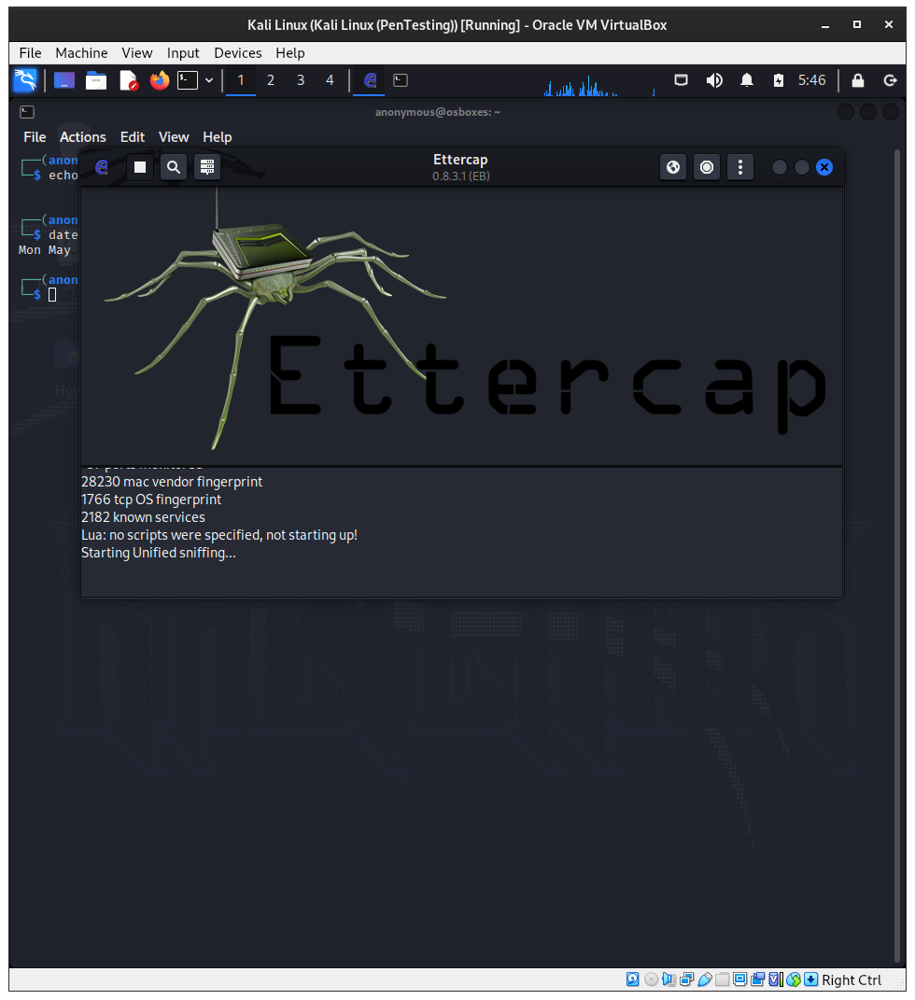

# __Projecte ASIX 2k22__
## __Escola Del Treball__
### __2HISX 2021-2022__
### __Aaron Andal & Cristian Condolo__

 

# __Ciberseguretat__: "_Careful where you step_" 🕵️ 🔎

    

# Index

* **Lorem Ipsum**: [Plantilla](https://github.com/KeshiKiD03/asixproject2k22/)

* **Lorem Ipsum**: [Plantilla](https://github.com/KeshiKiD03/asixproject2k22/)

* **Lorem Ipsum**: [Plantilla](https://github.com/KeshiKiD03/asixproject2k22/)

# Kali Linux

## Ettercap

EtterCapÉs una eina de rastreig de xarxa basada en la suplantació d'adreces ARP.  

Té olfacte de connexions dinàmiques, filtratge de contingut dinàmic i molts altres trucs interessants.  

És compatible amb l'anàlisi activa i passiva de molts protocols i inclou moltes característiques per a l'anàlisi de xarxa i amfitrió.  

És principalment adequat per canviar les xarxes dàrea local.  Amb lajuda del programari sniffer EtterCap, els provadors de penetració poden detectar la seguretat de la comunicació de dades de text clar a la xarxa i prendre mesures oportunes per evitar que les dades confidencials de nom dusuari / contrasenya es transmetin en text clar.

Amb __Ettercap__, podem simular un atac, un atac és una manera de destruir, exposar i obtenir accés no autoritzat a dades i ordinadors.

Un atacant és una persona que roba les vostres dades sense permís i una característica d'alguns atacs és que estan ocults.  

Els atacs no sempre són senzills;  la majoria són complexos i és un gran repte per als investigadors de seguretat i les empreses que ofereixen una solució per a ells.  

Un atac pot ser actiu o passiu:

+ __Ataque activo__: En este tipo de ataque, el atacante intenta alterar los recursos del sistema o destruir los datos. El Atacante puede cambiar los datos.

+ __Ataque pasivo__: En este tipo de ataque, el atacante intenta obtener información del sistema sin destruir la información. Este ataque es más bien de vigilancia y reconocimiento del objetivo.

    

Diferents tipus d'atacs actius i pasius:

Atac actiu:

+ Atac de denegació de servei (DoS).

+ Spoofing.

+ Man in the middle.

+ Enverinament ARP.

+ Desbordament.

Atac pasiu:

+ Escáneres de puertos.

+ Idle Scan (escaneo inactivo).

# Els atacs que es poden fer a Ettercap

## Eavesdropping (Escoltar atentament)

Segur que et resulta familiar;  és una cosa molt normal a la vida.  Imagina't que vols trobar alguna informació sobre dos amics i la seva relació.  Una manera molt senzilla és escoltar en secret les vostres paraules.  Aquest tipus d'atac també es produeix a les comunicacions informàtiques, però es coneix com a __sniffing__.

    

Quan xateges amb el teu amic en mode “text clar”, és possible olorar el teu trànsit.  Pot semblar antic, però pots estar segur que és un dels problemes de seguretat més grans en una xarxa que els administradors de xarxa no tenen en compte. 

## Falsificació de direccions IP (Address Spoofing o DNS Cache Poisoning + ARP Spoof)

Sé que saps què és una adreça IP (Protocol d'Internet).  Com saps, per comunicar-se amb altres ordinadors, cada ordinador necessita una IP.  En aquest atac, un atacant vol fer una adreça de destinació falsa i enganyar-te sobre això.  Per exemple, el teu objectiu és mibanco.com i un atacant reenvia la teva petició a un fals mibanco.com.  L'objectiu és suplantar el host víctima.

    

## Atac de denegació de servei (DoS)

En aquest tipus d'atac, un atacant intenta fer que una màquina o un recurs de xarxa no estigui disponible per als usuaris.  

L'objectiu és interrompre o suspendre els serveis que es connecten a Internet.  Aquest atac es dirigeix ​​a gateways i servidors web, com els dels bancs, i realitza alguns dels sabotatges següents.

+ Ús de recursos computacionals, com lample de banda, la memòria, lespai en disc o fins i tot la CPU.  Com suposo, la teva ment podria divagar cap al codi maliciós.  

+ Destrueix la informació i les taules d'encaminament.

+ Interrompre els components físics de la xarxa, com els routers, els switches i els firewalls.

+ Envia dades no vàlides a aplicacions o serveis de xarxa.  Podeu acabar anormalment els serveis.

+ Enviar molts paquets a les destinacions per inundar-los i finalment col·lapsar i apagar.

+ Bloquejar les destinacions i que els usuaris autoritzats no hi puguin accedir.

Al DDoS, un atacant pot utilitzar la tècnica del Zombie per capturar molts ordinadors i enviar moltes peticions a la víctima a través d'ells o de bots.  Zombie vol dir que un ordinador connectat a Internet ha estat compromès per un hacker.

    

## Atac Man in the Middle

L'atac man-in-the-middle (abreujat MITM, MitM, MIM, MiM, MITMA) és una forma d'atac actiu en què un atacant estableix una connexió entre les víctimes i envia missatges entre elles.  

Així, les víctimes creuen que estan parlant directament entre elles, però en realitat un atacant ho controla.  

En aquest escenari, un atacant ha tingut èxit quan es pot fer passar per un usuari.  

D'altra banda, hi ha una tercera persona entre tu i la persona amb qui et comuniques i pot controlar i vigilar el teu trànsit.  

    

Afortunadament, alguns protocols poden impedir-ho, com el SSL.  

Un hacker pot utilitzar el següent programari per implementar aquest atac:

* Caín i Abel

* Subterfugi

* __Ettercap__: És el que utilitzarem
 
* AirJack

* __SSLStrip__: L'utilitzarem per trencar el SSL.

* __SSLSniff__

# Bibliografia: 
https://esgeeks.com/tutorial-ettercap-ejemplos/
https://programmerclick.com/article/2815493326/
https://www.amirootyet.com/post/how-to-spoof-dns-in-kali-linux/
https://es.acervolima.com/ataque-mitm-man-in-the-middle-usando-arp-poisoning/
