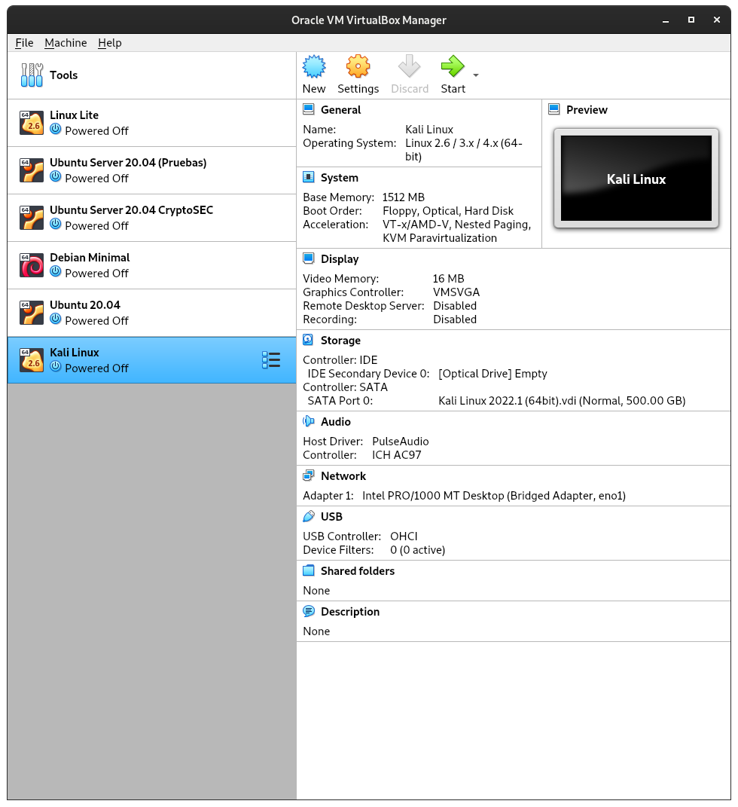

# __Projecte ASIX 2k22__
## __Escola Del Treball__
### __2HISX 2021-2022__
### __Aaron Andal & Cristian Condolo__

 
 
 
 

# __CryptoSEC__: "_Careful where you step in_"

> __Img Source__: *@Aaron & @Cristian 's GitHub*

 
 
 

# __Index__

+ **Kali Linux**: [Plantilla](https://github.com/KeshiKiD03/asixproject2k22/)

+ **Per a què serveis Kali Linux**: [Plantilla](https://github.com/KeshiKiD03/asixproject2k22/)

+ **Principals característiques de Kali Linux**: [Plantilla](https://github.com/KeshiKiD03/asixproject2k22/)

+ **Com s'instal·la Kali Linux?**: [Plantilla](https://github.com/KeshiKiD03/asixproject2k22/)

+ **Laboratori pentesting (Kali Linux)**: [Plantilla](https://github.com/KeshiKiD03/asixproject2k22/)

    + **Que es un laboratori per a pen testing de Kali Linux?**: [Plantilla](https://github.com/KeshiKiD03/asixproject2k22/)

+ **Qui utilitza Kali Linux?**: [Plantilla](https://github.com/KeshiKiD03/asixproject2k22/)

+ **Algunes eines de Kali Linux**: [Plantilla](https://github.com/KeshiKiD03/asixproject2k22/)

+ **Kali Linux**: [Plantilla](https://github.com/KeshiKiD03/asixproject2k22/)

# Kali Linux

Kali Linux és una distribució de Linux basada en Debian, específicament dissenyat per temes de seguretat molt varis. Aquestes son els anàlisis de xarxes, atacs WiFi, anàlisis forenses, _spoofing_ i altres. Conté eines per dur a terme totes aquestes proves de seguretat i anàlisi.

Kali Linux es troba entre les distribucions de seguretat de Linux més usades, ja que és una de les millors, tant per a ús personal com professional, proporcionant als usuaris paquets d'eines com Foremost, Wireshark, Maltigo as-Aircrack-ng, Kismet i més.

Algunes d'aquestes eines segur que et sonen força, sobretot Wireshark, de la qual tenim un interessant article el nostre bloc, parlant sobre la mateixa.

> __Img Source__: *https://elmonodelcodigo.com/wp-content/uploads/2018/04/kali-compressor.jpg*
 

# Per a què serveis Kali Linux?

Kali Linux compta amb multitud d'eines, tant en mode gràfic com, sobretot, per ordres, cosa que el converteix en un sistema molt complet, ja sigui per a defensors, que busquen un sistema més segur, com per a atacants a la recerca d'aquestes dades tan valuosos com comptes, contrasenyes i altres dades personals.

Entre tot el que es pot fer amb Kali Linux, en destaquem alguns aspectes:

- Recull d'informació

- Anàlisi de vulnerabilitat

- Atacs sense fil

- Aplicacions web

- Eines d'explotació

- Proves d'estrès

- Eines forenses

- Sniffing i Spoofing

- Atacs amb contrasenya

- Mantenir l'accés

- Enginyeria inversa

- Eines d'informació

- Hacking de maquinari

# Principals característiques de Kali Linux

Kali Linux és un programari força potent i amb multitud d'usos avançats perquè un administrador pugui aprofitar-la a fons.  

Destaquem algunes de les seves característiques principals:

- És gratis, no té cap cost per fer-lo servir tant personalment com professionalment.

- Compta amb més de 600 eines per treballar tot allò esmentat al punt anterior.

- Compte amb un suport magnífic, en diversos llenguatges i molt ben atès.

- No cal instal·lar-lo per utilitzar-lo, ja que té una manera live que permet utilitzar-lo des de dispositius portàtils a gairebé qualsevol sistema.

- Està desenvolupat en un entorn segur, cosa que ofereix moltes garanties sobre dades i fallades.

- Fes servir l'estàndard de jerarquia de sistema de fitxers (FHS) que permet biblioteques, fitxers de suport, etc.

> __Img Source__: *https://upload.wikimedia.org/wikipedia/commons/b/b3/VirtualBox_Kali_Linux_21.01_x64_Desktop_GER_26_02_2021_16_59_25.png*
 

# Com s'instal·la Kali Linux?

1. Accedir a la pàgina oficial de Kali Linux i descarregar-se la ISO.

2. Descarregar qualsevol _"Full Virtualization"_ machine, en aquest cas utilitzarem VirtualBox. També podem descarregar-nos una VDI ja feta de Kali Linux per agilitzar el procés en les bases de proves.

3. Crear una màquina (sense necessitat de grans recursos de memòria RAM i disc dur) i en la configuració demmagatzematge posar la ISO de Kali Linux.

4. Prémer en iniciar i realitzar la instal·lació, o bé executar-la directament (és recomanable instal·lar-la).

A continuació farem de forma detallada cóm s'utilitza Kali Linux implementant un _laboratori pentesting_.

# Laboratori pentesting (Kali Linux)

## Que es un laboratori per a pen testing de Kali Linux?

Un laboratori per a _pentesting_, és un entorn que muntem a local que estarà totalment controlat per nosaltres mateixos, per a fer tot tipus i experiments de serveis que tinguin una finalitat una prova a priori abans de ser implementades en __ordinadors reals__.

> __Img Source__: *https://dc722jrlp2zu8.cloudfront.net/media/cache/7b/c1/7bc153bfb08a081fc0ed7bdf1f8a6c5e.webp*
 

Primer necesitarem un software de virtualització per a fer les proves. La que utilitzarem es VirtualBox.

Virtualbox es una eina de virtualització gratuita, potent i multiplataforma. Per poder utilitzar-ho, només necessitem instal·lar-ho de la se va pàgina oficial. Activar la virtualització a la BIOS, això ens permetrà virtualitzar sistemes operatius en el nostre host. 

L'utilitzarem per virtualitzar Kali Linux.

> __Img Source__: *https://dc722jrlp2zu8.cloudfront.net/media/cache/39/e4/39e464179b96261481b33348d257a0eb.webp*
 

Ens descarregem Virtualbox i l'instal·lem, tindrem aquesta interfície.

> __Img Source__: *@Aaron & @Cristian 's GitHub*
 

Un cop tinguem el VirtualBOX. Podem instal·lar Kali Linux desde 0 o bé importar una màquina virtual amb Kali Linux ja instal·lat. Nosaltres hem utilitzat un Kali Linux ja instal·lat i l'hem importat amb el VirtualBox.

Un cop ens hem baixat la VDI de Kali Linux en aquest [enllaç](https://www.google.com/search?client=firefox-b-e&q=osboxes+kali+linux) i l'hem importat a VirtualBox, tindrem aquesta interfície.

> __Img Source__: *@Aaron & @Cristian 's GitHub*
 

# Qui utilitza Kali Linux?

Molts perfils del sector d'IT utilitzen distribucions Linux per a les seves feines i tasques diàries.  

També altres perfils hi tenen un paper clau, com són els Crackers.  

A les notícies i mitjans de comunicació utilitzen gairebé sempre el terme de Hacker, encara que en realitat el mateix només es refereix a algú amb coneixements de programació, mentre que els __Crackers__ són els que usen aquests coneixements amb fins pocs respectuosos i, sobretot, per a lucrar-se amb la informació obtinguda (emails, contrasenyes, xats, etc.), ja sigui venent-la a la Deep Web o a tercers.

Per evitar aquests robatoris es desenvolupen distribucions com Kali Linux, per lluitar contra ells i aconseguir sistemes cada cop més segurs cada dia.

Alguns dels llocs de treball que usen Kali són els següents:

* __Administradors de seguretat__: Són els responsables a les empreses de protegir la informació i les dades, tant de caràcter sensible, com els que no ho són. Utilitzen Kali Linux per assegurar-se, mitjançant proves i tests, que no hi hagi vulnerabilitats fàcilment detectables, ja siguin de màquines, emails i qualsevol altra cosa que puguin fer servir els __Crackers__.

* __Administradors de xarxa__: Són els responsables de mantenir una xarxa eficient i segura.  Utilitzen Kali Linux per auditar la seva xarxa i tenir clar què és visible des de l'interior i què no ho és, com, per exemple, la capacitat de detectar punts d'accés no autoritzats.

* __Arquitectes de xarxa__: Són responsables de dissenyar entorns de xarxa segurs, evitant així els problemes més comuns i mitjançant Kali Linux els problemes menys comuns.  Utilitzen Kali Linux per auditar els seus dissenys inicials i assegurar-se que res no es passi per alt o estigui mal configurat, ja que a causa de configuracions errònies solen ocórrer la majoria dels problemes que permeten l'accés als Crackers.

* __Pentesters__: Utilitzen Kali Linux per auditar i realitzar reconeixements en entorns corporatius per als que han estat contractats. El treball de testeig és fonamental per disposar d'entorns segurs.

* __Enginyers forenses__: Kali Linux posseeix un mode forense, que permet a un enginyer forense realitzar el descobriment i la recuperació de dades en alguns casos, ja que dependrà de determinats factors de l'equip.  Després d'aquests treballs previs, s'encarreguen de fer informes detallats de tot allò que s'ha trobat per a l'empresa que els va contractar.

* __White Hat Hackers__: Aquests _“hackers de barret blanc”_ usen Kali Linux per _auditar_ i _descobrir_ vulnerabilitats que poden ser presents en un entorn. Aquests no usen Kali Linux per a fins malèvols, al revés, són Hackers ètics.

* __Black Hat Hackers__: Aquests _“hackers de barret negre”_ usen Kali Linux per _descobrir_ i _explotar_ vulnerabilitats.  Kali Linux també té nombroses aplicacions d'enginyeria social, que poden ser utilitzades per un _Black Hat Hacker_ per comprometre una organització o individu.  Aquests sí que utilitzen Kali Linux amb _fins malèvols_, ja sigui particularment o professionalment, i són els coneguts com _Crackers_.

> __Img Source__: *https://cultura-informatica.com/wp-content/uploads/2021/12/Diferencias-Hacker-y-Cracker.jpg*
 

* __Grey Hat Hackers__: Aquests “hackers de barret gris” es troben entre els White Hat i els Black Hat Hackers. Utilitzaran Kali Linux en els mateixos mètodes que els dos enumerats anteriorment, ja que es dediquen a trencar sistemes de seguretat de les empreses per posteriorment oferir els seus serveis a les mateixes.

> __Img Source__: *https://linube.com/blog/wp-content/uploads/hacker.jpg*
 

* __Entusiasta de la informàtica__: Els popularment coneguts com a “frikis”, terme que es fa servir avui dia per als entusiastes de qualsevol tipus d'àmbit. És un terme força genèric, però qualsevol persona interessada a aprendre més sobre xarxes o ordinadors, en general, pot utilitzar Kali Linux per aprendre més sobre tecnologia de la informació, xarxes i vulnerabilitats comunes. __Post data__: Aquest som nosaltres :)

# Algunes eines de Kali Linux

## Ettercap

## Setoolkit

## THC Hydra

Es una eina que utilitza un atac de força bruta per desxifrar qualsevol servei d'autenticació remota.

Admet atacs de diccionari ràpids per a més de 50 protocols diferents, com ara: FTP, HTTPS, telnet, etc.

S'utilitza per accedir a xarxes sense fil, creadors de paquets, servidors de correus, etc.

## Netcat

Netcat més còmode per nc, és una utilitat de xarxa amb què es poden utilitzar protocols TCP/IP per llegir i escriure dades a través de connexions de xarxa.

Es pot utilitzar per crear qualsevol tipus de connexió, així com per explorar i depurar xarxes usant un mode de túnel, escaneig de ports, etc.

## Nmap

Nmap o Network Mapper és una eina d'utilitat gratuïta i de codi obert que utilitzen els administradors de sistemes per descobrir xarxes i auditar-ne la seguretat.

El seu funcionament és ràpid, està ben documentat, compta amb una GUI, admet transferència de dades, inventari de xarxa, etc.

## Nessus

Nessus és una eina d'escaneig remot que podeu utilitzar per verificar els ordinadors a la recerca de vulnerabilitats de seguretat.

No serveix per bloquejar activament cap de les vulnerabilitats que tinguin els equips, però les pot detectar executant ràpidament més de 12.00 comprovacions de vulnerabilitat i activant alertes per quan sigui necessari fer pegats de seguretat.

## Wireshard

WireShark és un analitzador de paquets de codi obert que podeu utilitzar de forma gratuïta.

Amb Wireshark, configurat correctament, es pot veure l'activitat dins una xarxa des del nivell més baix, juntament amb l'accés a fitxers pcap, informes personalitzables, disparadors avançats, alertes, etc.

## Snort

Snort és un NIDS gratuït i de codi obert amb què pots detectar vulnerabilitats de seguretat als ordinadors.

Amb Snorte es pot executar anàlisis de trànsit, cerca/coincidència de continguts, registre de paquets en xarxes IP i fins i tot detectar certes varietats d'atacs a una xarxa, entre moltes altres funcions;  i tot això a temps real.

## Hashcat

Hashcat és conegut entre la comunitat d'experts en seguretat, com ara l'eina de recuperació i desxifrat de contrasenyes més ràpida i avançada del món.

És de codi obert i compta amb un motor de regles al nucli, més de 200 tipus de Hash diferents, un sistema d'avaluació comparativa integrat, etc.

## John the Ripper

https://www.redeszone.net/tutoriales/seguridad/crackear-contrasenas-john-the-ripper/ 

> __Img Source__: *https://linube.com/blog/wp-content/uploads/Kali3.png*
 

## --> [ [Tornar a Ciberseguretat](https://github.com/KeshiKiD03/asixproject2k22/blob/main/README.md) ] <--

# Bibliografia
- https://medium.com/@williamkhepri/las-25-mejores-herramientas-de-kali-linux-b8c2a92f2ab4
- https://openwebinars.net/blog/kali-linux-que-es-y-caracteristicas-principales/
- https://openwebinars.net/blog/creacion-de-laboratorio-para-pentesting/
- https://openwebinars.net/blog/plataformas-para-practicar-y-aprender-hacking-etico/
- https://computerhoy.com/paso-a-paso/software/que-es-kali-linux-que-puedes-hacer-41671
- https://www.youtube.com/watch?v=ODvDxwmMkak
- https://codigofuente.io/hacking-etico-primeros-pasos/
- https://ciberninjas.com/kali-herramientas-20/
- https://esgeeks.com/tutorial-ettercap-ejemplos/
