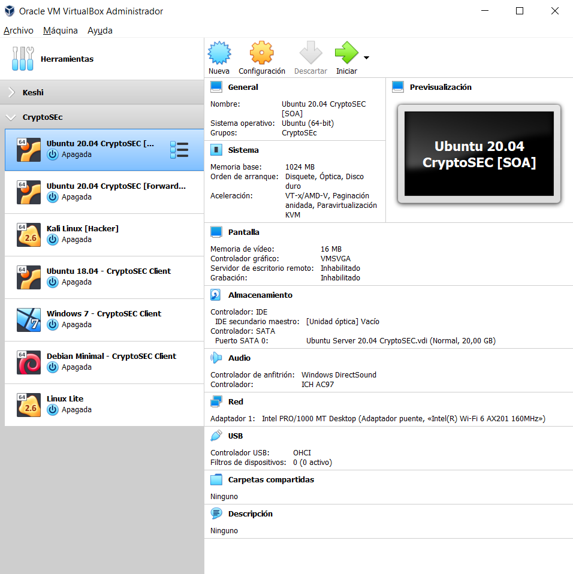

# __Projecte ASIX 2k22__
## __Escola Del Treball__
### __2HISX 2021-2022__
### __Aaron Andal & Cristian Condolo__

 

# __Ciberseguretat__: "_Careful where you step_"

    

 
 
 

# __Objectius "Projecte ASIX - Ciberseguretat:__ _Careful where you step_"

L'objectiu principal d'aquest projecte de Ciberseguretat, és la creació d'una empresa de __"Ciberseguretat"__ anomenamada _"CryptoSEC"_. Aquesta empresa implementarà una serie de serveis de __seguretat__ i __prevenció__ davant d'atacs maliciosos que tindràn la finalitat de _comprometre_ la empresa i obtenir informació delicada i confidencial. Aaron i Cristian, son els caps d'aquesta empresa i portaràn a terme aquest magnífic repte de protegir-se davant de _hackers_ com les de la Organització __"Anonymous"__, __" The Shadow Brokers"__, __"Elliott Gunton"__... entre altres.

La empresa de ciberseguretat en tot moment s'hi faràn auditoríes per detectar intrusos (__Wazuh__) en la xarxa de __"CryptoSEC"__, entre altres eines de prevenció i detecció. 

 
 
 

## __Arquitectura CryptoSEC__

__CryptoSEC.NET__ és una xarxa interna local en algun lloc remot del planeta on hi treballen els millors tècnics en __ciberseguretat__, però hi hà un __"intrús"__ que tindrà un _host maliciós_ que intentarà fer la vida impossible als altres clients.

Aquest host maliciós serà un __Kali Linux__ on hi dispondrà d'eines de seguretat, de _"hackeig"_ o _"crackeig"_, de _pentesting_, _accés a la xarxa_... entre altres. Aquest host maliciós farà atacs com el _"DNS Caché Poisoning - DNS Spoofing"_, juntament amb l'"_ARP Spoofing_" (enverinament de la caché dels servidors de _DNS SOA_ i _DNS Forwarder_ de CryptoSEC, amb posteriori suplantació i redirecció a una pàgina web _"fake"_ que serà reenviada com a resposta a la petició dels clients) 

Aquest host maliciós interferirà en la connexió entra el DNS autoritari SOA i el DNS Recursor que es qui farà de _resolver/forwarder_ dels __clients DNS__ que hi pertenèixen a la xarxa interna __"CryptoSEC"__. Serà un __DNS Forwarder__ més.

A __CryptoSEC__ implementarà, serveis com un DNS autoritari amb una zona anomenada __"cryptosec.net"__ que tindrà DNSSEC per assegurar les consultes DNS que hi facin els clients de la seva _"zona"_ o _"domini"_.

Al __DNS Forwarder__ tindrà serveis com __DHCP__ que brindarà una configuració automàtica de IPs i DNS als seus clients. Serà com un __router__. Tindrà politiques per defecte ACCEPT, i també permetrà que els seus clients tinguin NAT a l'exterior, és a dir, que puguin navegar per Internet. Tot amb __iptables__.

El __servidor principal autoritari__ anomenat com a hostname __"SOACryptosec"__ que serà un __Ubuntu Server 20.04__, tindrà només el _BIND9_ amb la zona __"cryptosec.NET"__, estarà ubicada en la xarxa de la classe _10.200.243.164/24_.

Tindrà un __servidor secundari forwarder__ anomenat com a hostname __"ForwardCryptosec"__ que serà també un __Ubuntu Server 20.04__ que tindrà el paper fonamental de fer de _resolver_ als clients DNS ja que ell mateix serà un forwarder i reenviarà les peticions de DNS a __"SOACryptosec"__ per a que resolgui peticions de DNS tant de __"cryptosec.net"__ com d'Internet, si no el sap el preguntarà als __ROOT SERVERS__, _a.k.a._ __Internet__. També tindrà aplicacions per monitoritzar la xarxa i detectar intrusos que intentin sacsejar la nostra xarxa __"cryptosec.net"__.

Com hi haviem comentat, a __CryptoSEC__ hi englobem diferents serveis en funcionament, com __detecció d'intrusions (Wazuh)__ o algunes de __prevenció d'atacs__, tot explicant breument cada cascuna dels diferents serveis que hi componen la nostra organització: __"CryptoSEC"__.

 

    

 

Durant aquest projecte, ens trobarem diferents _reptes_ tant en l'àmbit _tècnic_ com en l'àmbit _sistemàtic_. Haurem de ser capaços de resoldre aquests reptes amb l'ajuda bé de diferents companys de classe, o de la informació investigada per Internet.

En la recerca d'informació de tota la documentació, independentment de les seves funcionalitats, les bateries de proves, el control de versions fins a arribar a l'últim "_stage_" del projecte. Es farà un seguiment de tot el que es fa, es farà i el que s'està fent en hores de projecte.

    

 
 
 

# __Conceptes i aspectes generals _"mindset"_ del projecte__

Tenim una idea clara, _primer_ la recerca d'informació i recapitulació de tots els _serveis_ que utilitzarem, _segon_ un petit exemple de funcionament del servei en qüestió i finalment, l'assemblació al cos del projecte.

Tot això després de verificar que compleixen aspectes tant de la informàtica o concretament a la __ciberseguretat__ que un __auditor o defensor de ciberseguretat__ ha de conèixer: 

+ La __identificació__: 

    + És necessari identificar els __processos__ i __actius__ crítics d'alguna. 
    
    + S'ha de mantenir __actualizat__ l'__inventari__ tant de __hardware__ o __software__. 
    
    + Conèixer les __característiques__, ja que amb freqüència son punts d'entrada de programes i aplicatius __maliciosos__. 
    
    + Cal identificar __amenaçes__, __vulnerabilitats__ i __riscos__ per als actius. 
    
    + Cal assegurar-se que s'estableixin i administrin processos de gestió de __riscos__ per garantir que __s'identifiquin__, avaluïn i administrin les amenaces internes i externes, cosa que s'ha de documentar degudament en registres de riscos.

+ La __protecció__: 

    + Convé __administrar__ l'accés als __actius__ i la __informació__. 
    
    + La companyia ha de crear comptes únics per a cada empleat i assegurar-se que els usuaris només tinguin accés a la informació, els ordinadors i les aplicacions que necessiten per als seus treballs. 
    
    + Cal __administrar__ i __rastrejar__ estrictament l'accés __físic__ als dispositius.

    + Realitzar __còpies de seguretat__ periòdiques és útil. Una bona pràctica és mantenir un conjunt de dades de còpia de seguretat freqüent fora de línia per protegir contra el ransomware.

    + S'han d'implementar __polítiques formals__ per a l'eliminació segura de fitxers electrònics i dispositius en desús.

+ Els __backups__: És important assegurar la informació abans i després de que s'hagin provocat _"desastres informàtics"_. Una bona recuperació o _cleaning_ d'avant d'aquest escenari és clau per retomar una activitat d'una empresa.

+ La __detecció__: 

    + És important desenvolupar i provar processos i procediments per detectar accions no autoritzades a les xarxes ia l'entorn físic, inclosa l'activitat del personal.

    + Cal comprendre l'impacte dels esdeveniments de ciberseguretat. Cal treballar ràpidament i exhaustivament per comprendre l'amplitud i la profunditat de l'impacte. Així com comunicar informació sobre l'esdeveniment amb les parts interessades apropiades.
    
    + Cal monitoritzar els ordinadors per controlar si es detecta accés de personal no autoritzat als ordinadors, dispositius (suports demmagatzematge de dades de tipus USB) i programari. Heu de revisar la xarxa per controlar si es detecten usuaris o connexions no autoritzats.

+ La __resposta__: 

    + Els plans de __resposta__ s'han de provar per assegurar-se que cadascú conegui les seves __responsabilitats__ en la seva execució.

    + Coordinar amb les parts interessades internes i externes és vital davant el desastre. 
    
    + Cal assegurar-se que els plans de resposta i les actualitzacions incloguin totes les parts interessades clau i proveïdors de serveis externs. Poden contribuir a millores en la planificació i execució.

+ La __recuperació__: 

    + Cal comunicar-se amb usuaris afectats, tant de dins con de fora davant d'aquests desastres, per fer un plà de recuperació.

    + La comunicació és clau per protegir-se.

    + Cal assegurar-se que els plans de recuperació estiguin __actualitzats__.

    + S'han de reparar i restaurar els equips i les parts de la xarxa que van resultar afectats.

 

    

 

 
 
 

## __Deployment__

Hem decidit utilitzar __VirtualBox__ per al _deployment_ d'aquest projecte simplement amb la facilitat d'utilització, la compatibilitat tant de __Linux__, __Windows__ o __MAC__ i la versatilitat alhora de clonar, encendre, interactuar amb la virtualització de les màquines virtuals. 

 

    

 

A més de que tenim un control avançat alhora de _"toquetejar"_ l'emulador de VirtualBox tant a nivell de __hardware__ com a nivell de __software__.

El servidor __"ForwardCryptosec"__ farà de router on hi tindrà 2 interfícies (__enp0s3__) i (__enp0s8__), la primera serà un __"bridge"__ i en la segona serà una __xarxa interna__ anomenada __"cryptosec"__ on hi tindràn la IP 192.168.3.0/24.

El servidor __"SOACryptosec"__ serà un servidor autoritari on hi tindrà la zona __"cryptosec.net"__ hi tindrà 2 interfícies (__enp0s3__) i (__enp0s8__), la primera serà un __"bridge"__ i en la segona serà una __xarxa interna__ anomenada __"cryptosec"__ on hi tindràn la IP 192.168.3.0/24.

Tots els clients de la xarxa de __"cryptosec"__ han de passar per el router per poder navegar a l'exterior o fer peticions DNS (En aquest cas han de preguntar al __resolver__ __RecursorCryptosec__).

El servidor __"SOACryptosec"__ farà de router emetrà IPs automàticament gràcies a DHCP i donarà els nameservers adequats a les seves xarxes internes per a que puguin navegar a Internet. També s'hi farà NAT a l'exterior on hi navegaràn _enmascarats_.

 

    

 

## __Ciberseguretat: CryptoSEC__

+ L'__aïllament en la xarxa interna__: Mecanisme de seguretat que permetrà separar els programes en execució, per tal de mitigar errors del sistema o vulnerabilitats de software. Gracies a la nostra xarxa interna __"cryptosec"__.

+ __Xifratge de dades__: Comunicació xifrada en tot moment a CryptoSEC. Els clients podràn fer resolucions al seu _resolver_ de forma segura utilitzant "__criptografía asimétrica__". D'aquesta forma l'atacant hacker no podrà dur a terme el seu atac __man in the middle__ amb __spoofing__.

+ __Protegirse davant la vulnerabilitat__: Davant d'un atac maliciós, d'una denegació de servei DDOS, d'un metaexploit, d'un phishing, d' un spoofing... etc. Hem de saber com actuar davant d'aquests escenaris. Millor prevenir que lamentar-nos! 

 

# La proposta final

+ Un deployment a VirtualBox de dos servidors Ubuntu Server 20.04, un en bridge i xarxa interna _"cryptosec"_ i l'altre servidor i els clients estaràn en la xarxa interna _"cryptosec"_ on hi faràn NAT a l'exterior mitjançant IPTABLES per poguer navegar a Internet. Hi hauràn 2 clients també en diferents xarxes simulant connectar-se per VPN (WireGuard).

+ Durant l'assemblatge final, es faràn diversos atacs a l'empresa __CryptoSEC__, i l'empresa es protegirà davant d'aquestes amenaçes on es posaràn en perill la integritat de l'empresa.

+ L'atacant farà els atacs des d'un Kali Linux.

    

# __Els objectius dels serveis de CryptoSEC__

## __Wazuh (Host Intrusion Detect)__

+ Detectar i monitoritzar la infraestructura, les amenaçes i l'intent d'intrusió. 

+ També detectarà anomalies del sistema o aplicacions mal configurades o accions d'usuari no autoritzats.

### __OpenSSL__

+ Asseguració de la connexió mitjançant la __criptografía__. Utilitzant TLS com a protocol de _transport_ i _SSL_.

### __DNS + DNSSEC (Asymmetric Cryptography)__

+ Implementació de BIND9.

+ Entendre conceptes de DNS, zones i registre de recursos.

+ Entendre DNSSEC:

    + Claus firmades,

    + DNSKEY, RRSIG, NSEC, NSEC3...

+ Creació i administració de claus per a la zona "CryptoSEC".

+ Resoldre problemes de servidor de noms autoritzats que atén zones segures com DNSSEC de "CryptoSEC".

+ Configuració BIND com un servidor recursiu que realitza la validació DNSSEC en nom dels seus clients.

+ TSIG per a una comunicació segura amb BIND.

### __Let's Encrypt ACME - Certbot HTTPS__

https://letsencrypt.org/es/how-it-works/
https://datatracker.ietf.org/doc/html/rfc2986
https://computingforgeeks.com/easiest-way-install-letsencrypt-linux/

https://www.digitalocean.com/community/tutorials/how-to-secure-apache-with-let-s-encrypt-on-ubuntu-20-04-es

https://www.digitalocean.com/community/tutorials/how-to-secure-apache-with-let-s-encrypt-on-ubuntu-20-04-es
https://geekflare.com/es/apache-with-lets-encrypt-cert/

¡UNDER CONSTRUCTION!

### __Encrypted File Systems__

¡UNDER CONSTRUCTION!

### __Vulnerabilitats__

Alguns exemples de:

+ DDOS

+ Keylogger

+ Rootkit

+ Man in the Middle

+ Rogue Access Points

+ Phishing

+ Address Spoofing

+ Metaexploits

... entre altres

# Bibliografia

- https://www.lpi.org/our-certifications/exam-303-objectives 
- https://www.auditool.org/blog/auditoria-de-ti/8200-5-aspectos-de-ciberseguridad-que-todo-auditor-debe-conocer-para-evaluar-y-recomendar 
- https://www.rosario3.com/ecos365/noticias/Cuales-son-los-aspectos-clave-en-ciberseguridad-20190722-0011.html 