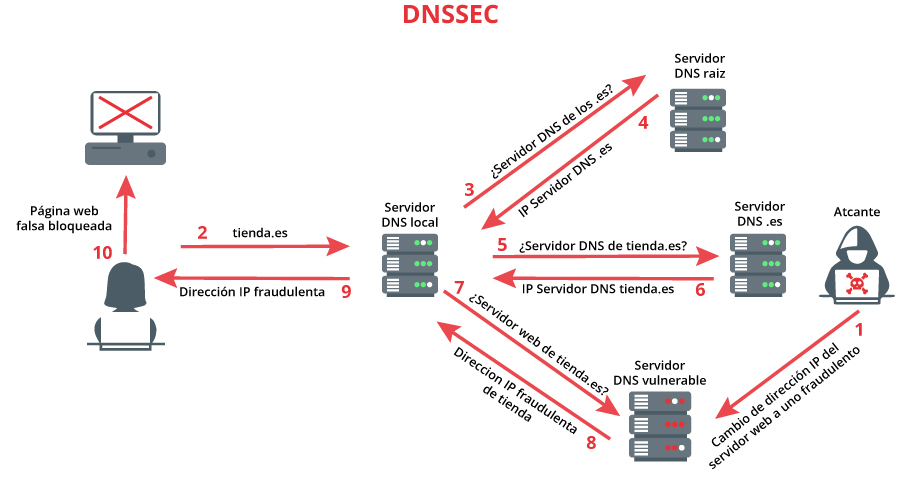
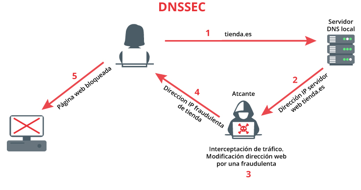
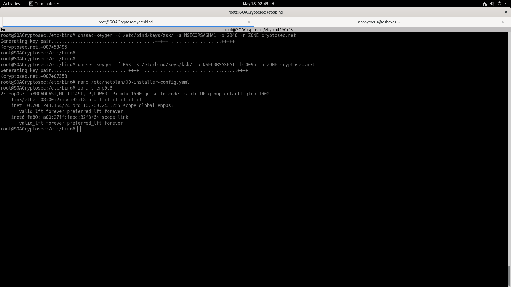
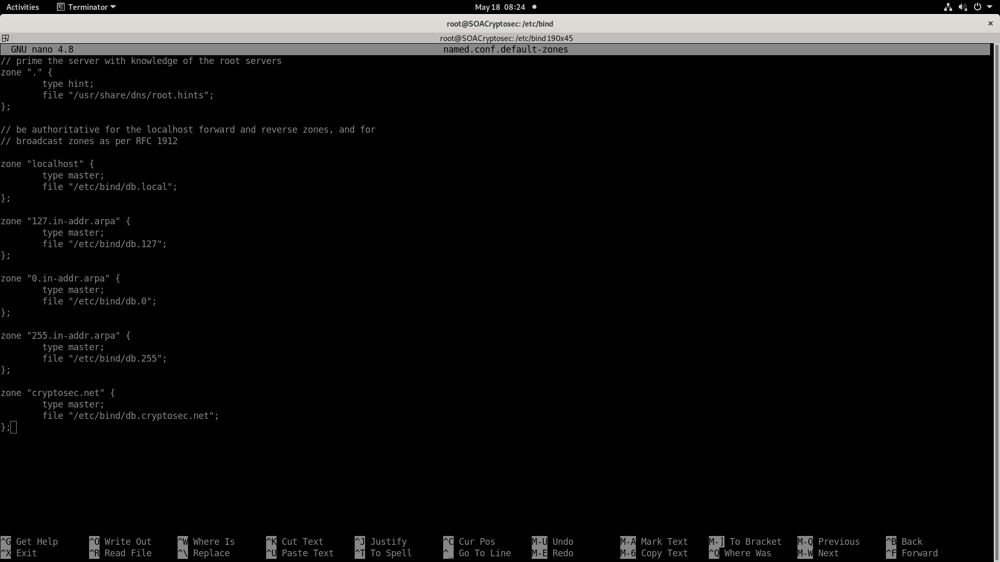
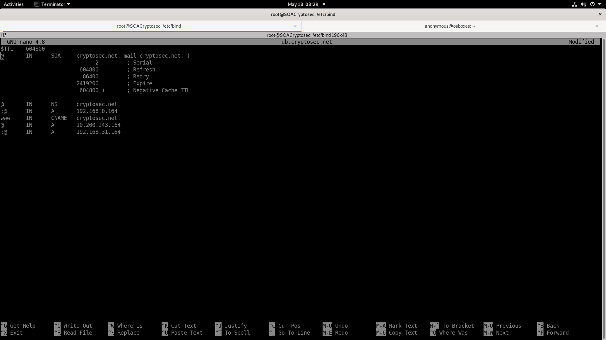
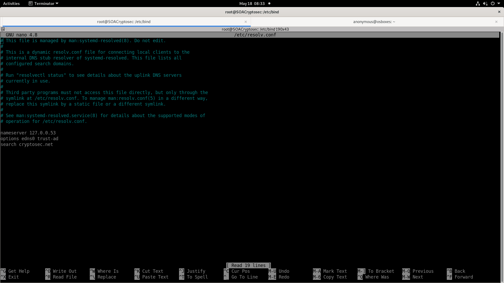
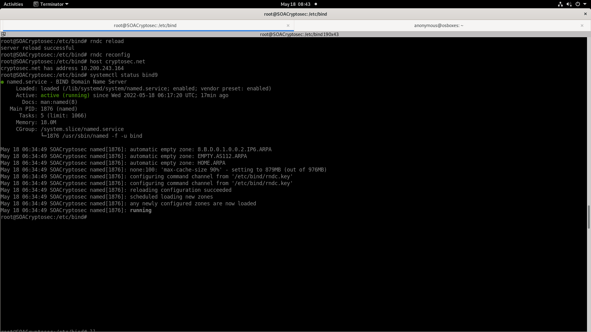
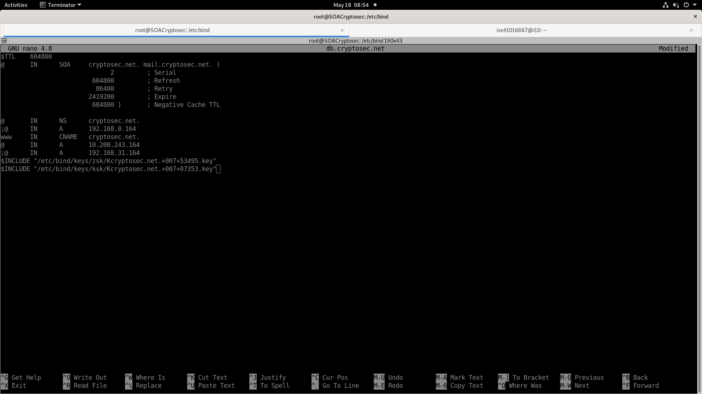
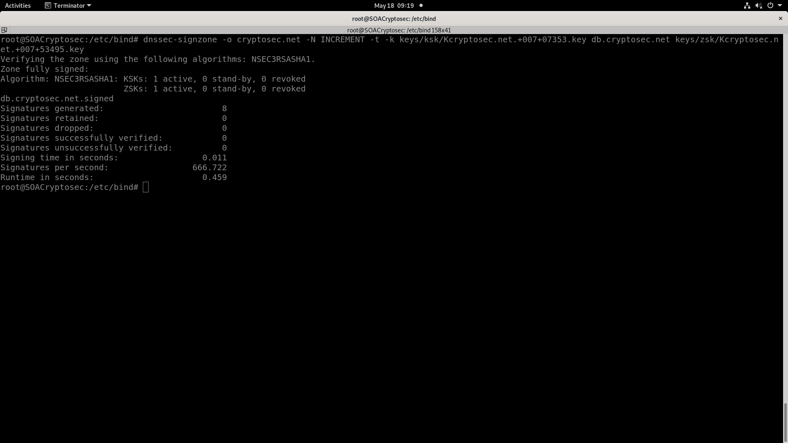
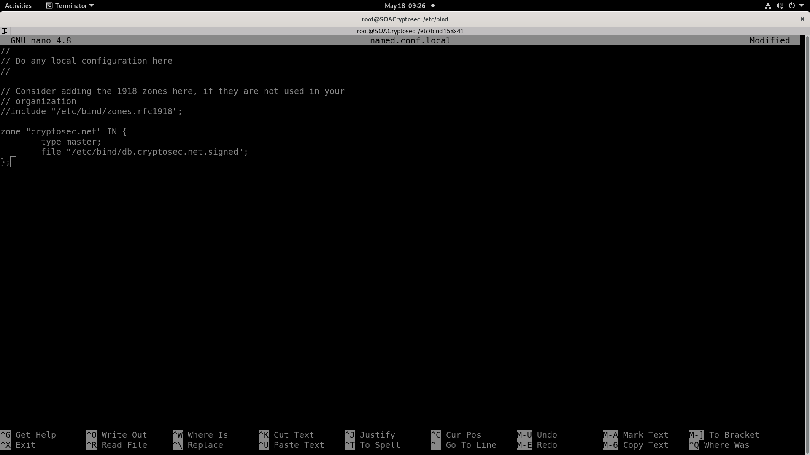

# __Projecte ASIX 2k22__
## __Escola Del Treball__
### __2HISX 2021-2022__
### __Aaron Andal & Cristian Condolo__

<br>

# __Ciberseguretat__: "_Careful where you step_"


<br>
<br>
<br>

# Index

* **Introducció**: [Plantilla](#introducció)


* **Descripció**: [Plantilla](#descripció)


* **Practica**: [Plantilla](#practica)


* **Bibliografia**: [Plantilla](#bibliografia)


# DNSSEC (Dominion Name System Security Extension)
## Introducció
Unes de les tante defenses d'Internet es el __sistema de noms de domini__, o bé ***DNS***. Aquest protocol te com a objectiu traduir els noms de domini que utilitza l'usuari en adreces IP que es poden interpretar les maquines.

Els DNS treballen amb bases de dades en els que s'__emmagatzema els registres__ amb l'informació dels __dominis__ i les seves __IP__. La seva seguretat el fa capaz quan intenten falsificar els registres, pero encara es vulnerable als __redireccionament__ a __lloc maliciosos__ i __suplantació__, o també l'__intercepció de trafic__.

 
<br><br>

Per donar sol·lució aquells problemes es va dissenyar lo que es coneixe com __extension de seguretat pel sistema de noms de domini__, o bé DNSSEC.

## Descripció
**Que es?**
Afegeix una __capa de seguretat adicional__ als servidors DNS d'un domini. Gracies a allo es __preveixen un gran quantitat de posibles activitats malicioses__. Aquesta extensió __comprova l'integritat i autenticació de les dades__.

**Com funciona?**
Les noves funcions d'aquest protocol estan basades en la __criptografia asimetrica__, tambe coneguda com __criptografia de claus publiques i privades__. Mitjançant el us de les clau i les firmes generades a partir de les claus, que es pot saber __si l'informacio ha sigut modificat o no__.

Quan un client realitza una recerca de domini que compta amb DNSSEC, en __el proces s'envia l'informació necessaria per resolver la recerca__ (adreça IP del domini que esta buscant). Pero tambe __s'envien unes quantes firmes de les claus associades als diferents servidors DNS__ que esta consultant.

Si al comprovar aquestes __firmes no coinceixen les uns amb les altres__, la consulta __no pot se valida__ como legitimad doncs __la cadena de confiança s'ha trencat__ i por lo tant __no es segur accedir__ aquell lloc web. Pel contrari, __si coincideixen__ les uns amb les altres, l'usuari __podrà accedir__ ja que el proces ha sigut autenticat i __la cadena de confiança no s'ha trencat__.

## Practica
Obrim la nostra maquina Ubuntu Server per posar a prova el ``DNSSEC``. L'engeguem, després de fer un __snapshot__ per seguretat.


<br>

La nostra maquina tindra dues interficies: un en al bridge y l'altre a una xarxa interna.

En aquesta practica utilitzarem l'inteficie ``enp0s8``, la que esta connectada a la xarxa interna. Tenim que activar-la abans de ficar la seva IP.
```
sudo ip link set enp0s8 up
```

---
> **Nota**: *en cas de que estiguem fent un practica, no haurem de cambiar l'IP desde cap fitxer de configuració. Com es una prova insertarem una ip temporal per practica, i cada cop que engeguem la maquina haurem d'insertar l'ip una altra vegada.*

Per ficar l'IP, amb les següents comandes:
```
sudo ip address add 192.167.3.1/24 dev enp0s8
ip a show enp0s8
```


---

> **Nota**: *en cas de que estiguem modificant la maquina , haurem de canviar l'IP des dels fitxer de configuració del networking. Aquesta maquina Ubuntu te fitxer de configuracio diferents a les que estic mes familiaritzat. Aixo es lo que trobat.*

Dins de ``/etc/netplan``, editem el fitxer de configuració ``00-installer-config.yaml`` i afegim les següents linies:
```yaml
network:
  ethernets:
    enp0s3:
      dhcp4: no
      addresses:
      - 10.200.243.164/24
      gateway4: 10.200.243.1
      nameservers:
        addresses: [10.200.243.164, 10.200.240.10]
        search: [cryptosec.net]
```


<br>

Sortim del fitxer i salvem la configuracio amb el comand ``netplan``:
```
sudo netplan try
```

Podem comprobar el cambi d'IP amb:
```
ip a show enp0s8
```


---
---

Fem tota la practica com ``root``.

Dins de la maquina Ubuntu, instal·lem el ``bind9``:
```
apt update
apt install bind9 bind9utils
```

Entrem dins de la seva carpeta de configuració ``/etc/bind``, on esta les seves configuracions i les zones que gestiona.

Lo primer que hem de fer es habil·litar l'extensió DNSSEC dins del servidor DNS, accedim al fitxer ``/etc/bind/named.conf.options`` i l'editem
```sh
dnssec-enable yes;
dnssec-validation yes;
dnssec-lookaside auto;
```


Comprovar si el servidor esta validan amb les ordres ``dig``:
```
dig @localhost www.apnic.net
```


Tinguem en compte que cada resposta te una signatura corresponent (__registre RRSIG__).

Una __resposta valida__ hauria de tenir la capçalera tindra l'estat HEADER: **NOERROR** i resolve amb l'IP firmada.

Una __resposta__ que __no estigui validada__ tindra l'estat HEADER: **SERVERFAIL** sense la zona firmada.

> **Nota**: *haurem de tenir el nostre domini creat al principi, pero en cas de no haver-le creat. Aqui t'ho mostro.*

Creem la nostra zona de domini ``cryptosec.net``, primer ho afegim dins de fitxer ons les zones es gestionen: ``named.conf.default-zones``.
```sh
zone "cryptosec.net"{
    type master;
    file "/etc/bind/db.cryptosec.net";
}
```


Despres creem y editem el fitxer de configuració de la zona que hem indicat abans: ``db.cryptosec.net``.
```sh
$TTL    604800
@       IN      SOA     cryptosec.net. mail.cryptosec.net. (
                              2         ; Serial
                         604800         ; Refresh
                          86400         ; Retry
                        2419200         ; Expire
                         604800 )       ; Negative Cache TTL

@       IN      A       10.200.243.164 # IP maq bridge (enp3s0)
@       IN      NS      cryptosec.net.
www     IN      CNAME   cryptosec.net.
```


Anem a ``/etc/resolv.conf`` i comprovem que servidor resolv pregunti al dns de l'escola EDT i que busqui la zona ``cryptosec.net``.
```
nameserver 127.0.0.53
options edns0 trust-ad
search cryptosec.net
```


Comprovem que el servidor DNS resolv la nostra zona de domini amb ``host`` i ``rndc``.
```
rndc reload
rndc reconfig
host cryptosec.net
systemctl status bind9
```

> **Nota**: *si volem podem veure els errors amb ``journalctl -u named -f &`` i reiniciar el DNS amb ``systemctl restart``.*


---
---

Ara si passem a generar les assignatures DNSSEC per als propietaris de dominis.

Això sol ser per registres i proveïdors d'allotjament, o qualsevol usuari que sigui propietari d'un domini.

Creem un fitxer per posar les claus
```
mkdir keys
```

**Generar parell de claus per a ZSK (Zone Signing Keys) i KSK (Key Signing Keys)**

> **Nota**: *l'ordre de generar la ZSK i la KSK no importa. Nomes importe que les tenim les dues claus per poder signar la zona.*

Primer, generem la clau de __signatura de zona__ (ZSK). La sintaxi es la següent:

``dnssec-keygen -a <ALGORITME> -b <BITS> -n ZONE <NOM DE LA ZONA>``
- -a: *algoritme de criptació*
- -b: *la mida de la clau*

Si no especifiquem, els valors per defecte son RSASHA1 per a l'algorisme i una mida de clau de 1024 per a ZSK i 2048 per a KSK. Quedari aixi: ``dnssec-keygen cryptosec.net``

Utilitzem un algorisme més segur i bits més llargs per generar ZSK. La comanda serà la següent:
```
dnssec-keygen -K /etc/bind/keys/zsk/ -a NSEC3RSASHA1 -b 2048 -n ZONE cryptosec.net
```
- -K: *directori on s'han d'escriure els fitxers de claus*


A continuació, generem la __clau de signatura de claus__ (KSK). L'ordre és molt semblant, amb un parell d'ajustaments.
```
dnssec-keygen -f KSK -K /etc/bind/keys/ksk/ -a NSEC3RSASHA1 -b 4096 -n ZONE cryptosec.net 
```
- -b: __canvia la mida de la clau__
- -f: *especifica el tipus que es*, o t'ho possar un ZKS.


Obtindrem 4 claus en total: parells privats/públics de ZSK i KSK.

**Signatura de les zones**

En aquesta fase hi ha dues formes de fer-ho: __la manual__ i __l'automatica__.

**1. Signatura manual la signatura**

Examinem les claus que tenim les clau necesaries. Com hem dit abans, veïem que tenim mes de dos, nomes necesitem les publiques (``.key``).

Fem referencia de les dues claus publiques a dins del fitxer de la zona.
```sh
$INCLUDE "/etc/bind/keys/zsk/Kcryptosec.net.+007+53495.key"
$INCLUDE "/etc/bind/keys/ksk/Kcryptosec.net.+007+07353.key"
```
> Nota: si tinguessim les clau en un sol dir, una manera rapida d'afegir les claus a la zona:
> ```
> for key in `ls Kexample.com*.key`
> do
> echo "\$INCLUDE $key">> example.com.zone
> done
> ```



Ara ja podem signar la zona amb les claus secretes. Aqui esta la sintaxi:

``dnssec-signzone -o <nom de zona> -N INCREMENT -t -k <dir/KSK> <fitxer de zona> <dir/ZSK> ``
- -o: indica "l'origen" de la zone, es a dir __el domini__.
- -N: indica que hem de pujar el nombre de serie de la zona , a més de firmar-la.
- -t: mostra estadistiques quan acaba
- -k: especifica la clau de signatura de clau

Per el nostre exemple, l'ordre hauria de ser:
``` 
dnssec-signzone -o cryptosec.net -N INCREMENT -t -k keys/ksk/Kcryptosec.net.+007+07353.key db.cryptosec.net keys/zsk/Kcryptosec.net.+007+53495.key
```



Això crea un fitxer nou anomenat ``db.cryptosec.net.signed`` que conté registres RRSIG per a cada registre DNS.

Hem de dir a BIND que carregui aquesta zona "signada". Per fer-ho, editeu el fitxer ``named.conf.local`` i apuntem a la zona signada. I l'altre zona definida en el fitxer ``named.conf.default-zones`` la comentem.
```sh
zone "cryptosec.net." IN {
            type master;
            file "db.cryptonet.net.signed";
};
```



I reinciem el bind9.
```
systemctl restart bind9
journalctl -e
```


**2. Signatura automàtica**

L'altre mètode és utilitzar la signatura automàtica. Actualitzeu la configuració de la següent manera per afegir les tres últimes línies dins del fitxer ``named.conf.default-zones``:
```sh
zone "cryptosec.net"{
    type master;
    file "/etc/bind/db.cryptosec.net";
    key-directory "/etc/bind/keys";
    auto-dnssec maintain;
    inline-signing yes;
};
```

> **Nota**: *el directori de claus és la ubicació de les claus KSK/ZSK. L'usuari de BIND ha de tenir accés de "lectura" a això, així que actualitzeu els vostres permisos en conseqüència.*

auto-dnssec té dues opcions: allow o maintain:
* **auto-dnssec allow**: cerques al directori de claus i signa la zona amb les claus corresponents un cop rep l'ordre rndc sign.
* **auto-dnssec maintain**: fa el mateix que anteriorment, però també comprova periòdicament el directori de claus.

Amb l'ordre ``rndc`` (Remote Name Daemon Control), podem aplicar la configuració actualizada feta anteriorment i carregar les claus des del directori donat.
```
rndc reload 
rndc reconfig 
rndc loadkeys cryptosec.net
```

A continuació, signem la zona amb l'ordre següent:
```
rndc signing -list cryptosec.net
```

## Bibliografia
- https://www.dondominio.com/help/es/266/dnssec-que-es-y-como-funciona/
- https://www.incibe.es/protege-tu-empresa/blog/dnssec-asegurando-integridad-y-autenticidad-tu-dominio-web
- https://bytelearning.blogspot.com/2016/12/como-proteger-servidor-DNS-Linux-DNSSEC.html
- https://es.slideshare.net/alejandrotakahashi5/servidores-ubuntu-1804-dnssec-dmz-firewall-servidor-archivos-e-ipv6
- https://blog.apnic.net/2019/05/23/how-to-deploying-dnssec-with-bind-and-ubuntu-server/
- https://blog.inittab.org/administracion-sistemas/dnssec-asegurando-las-respuestas-de-nuestro-dominio-la-practica-i/
- https://es.wikipedia.org/wiki/Domain_Name_System_Security_Extensions
- https://www.icann.org/es/blogs/details/dnssec-rolling-the-root-zone-key-signing-key-22-7-2016-es
- https://www.stackscale.com/es/blog/ceremonia-clave-firma-llave-zona-raiz-dnssec/
- https://www.cloudflare.com/es-es/dns/dnssec/how-dnssec-works/
- https://kb.isc.org/docs/aa-01182
- https://linux.die.net/man/8/dnssec-keygen
- https://techglimpse.com/dnssec-configuration-procedure-testbed/