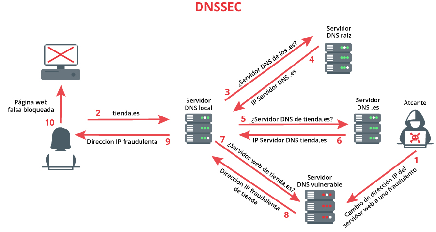
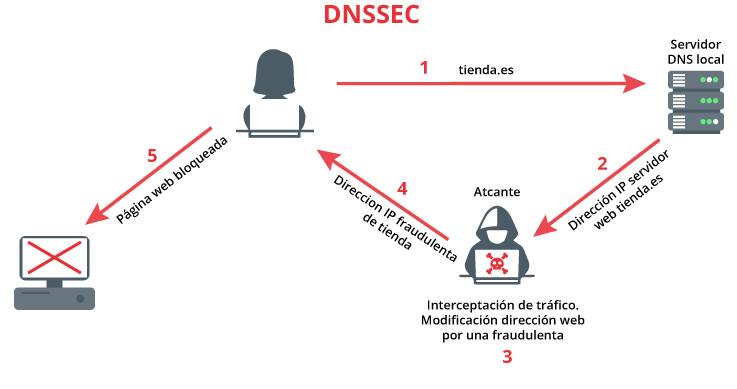

# __Projecte ASIX 2k22__
## __Escola Del Treball__
### __2HISX 2021-2022__
### __Aaron Andal & Cristian Condolo__

<br>

# __Ciberseguretat__: "_Careful where you step_" 🕵️ 🔎

<div style="align: center; width: 100%">
    
</div>

# Index

* **Introducció**: [Plantilla](#introducció)


* **Descripció**: [Plantilla](#descripció)


* **Practica**: [Plantilla](#practica)


* **Bibliografia**: [Plantilla](#bibliografia)


# DNSSEC (Dominion Name System Security Extension)
## Introducció
Unes de les tante defenses d'Internet es el __sistema de noms de domini__, o bé ***DNS***. Aquest protocol te com a objectiu traduir els noms de domini que utilitza l'usuari en adreces IP que es poden interpretar les maquines.

Els DNS treballen amb bases de dades en els que s'__emmagatzema els registres__ amb l'informació dels __dominis__ i les seves __IP__. La seva seguretat el fa capaz quan intenten falsificar els registres, pero encara es vulnerable als __redireccionament__ a __lloc maliciosos__ i __suplantació__, o també l'__intercepció de trafic__.

 <br><br>

Per donar sol·lució aquells problemes es va dissenyar lo que es coneixe com __extension de seguretat pel sistema de noms de domini__, o bé DNSSEC.

## Descripció
**Que es?**
Afegeix una __capa de seguretat adicional__ als servidors DNS d'un domini. Gracies a allo es __preveixen un gran quantitat de posibles activitats malicioses__. Aquesta extensió __comprova l'integritat i autenticació de les dades__.

**Com funciona?**
Les noves funcions d'aquest protocol estan basades en la __criptografia asimetrica__, tambe coneguda com __criptografia de claus publiques i privades__. Mitjançant el us de les clau i les firmes generades a partir de les claus, que es pot saber __si l'informacio ha sigut modificat o no__.

Quan un client realitza una recerca de domini que compta amb DNSSEC, en __el proces s'envia l'informació necessaria per resolver la recerca__ (adreça IP del domini que esta buscant). Pero tambe __s'envien unes quantes firmes de les claus associades als diferents servidors DNS__ que esta consultant.

Si al comprovar aquestes __firmes no coinceixen les uns amb les altres__, la consulta __no pot se valida__ como legitimad doncs __la cadena de confiança s'ha trencat__ i por lo tant __no es segur accedir__ aquell lloc web. Pel contrari, __si coincideixen__ les uns amb les altres, l'usuari __podrà accedir__ ja que el proces ha sigut autenticat i __la cadena de confiança no s'ha trencat__.

## Practica
Obrim la nostra maquina Ubuntu Server per posar a prova el ``DNSSEC``. L'engeguem, després de fer un __snapshot__ per seguretat.

> **Nota**: *per aquesta practica no haurem de cambiar la ip desde cap fitxer de configuració. Com es una prova inserta un ip temporal per practica, cada cop que engeguem la maquina haurem d'insertar l'ip una altra vegada.*

La nostra maquina tindra dues interficies: un en al bridge y l'altre a una xarxa interna.

En aquesta practica utilitzarem l'inteficie ``enp0s8``, la que esta connectada a la xarxa interna. Per ficar l'IP primer hem de activar l'interficie i ja ficar l'IP.
```
sudo ip link set enp0s8 up
sudo ip address add 192.167.3.1/24 dev enp0s8
ip a show enp0s8
```

Dins de la maquina Ubuntu, instal·lem el ``bind9``:
```
sudo apt update
sudo apt install bind9
```

Entrem dins de la seva carpeta de configuració ``/etc/bind``, on esta les seves configuracions i les zones que gestiona.

Lo primer que hem de fer es habil·litar l'extensió DNSSEC dins del servidor DNS, accedim al fitxer ``/etc/bind/named.conf.options`` i l'editem
```sh
dnssec-enable yes;
dnssec-validation auto;
```

Comprovar si el servidor esta validan amb l'ordre ``dig``:
```
dig @localhost www.apnic.net
```

Tinguem en compte que cada resposta te una signatura corresponent (__registre RRSIG__).

Una __resposta valida__ hauria de tenir el senyalador de bits __AD__ (Authenticated Data) establert i la capçalera tindra l'estat: **NOERROR**.

Una __resposta__ que __no estigui validada__ no tindra una senyal de AD establert i l'estat HEADER sera **SERVERFAIL**.

En el nostre cas, no esta del tot valida ya que li falta el __AD__.

> **Nota**: *haurem de tenir el nostre domini creat al principi, pero en cas de no haver-le creat. Aqui t'ho mostro.*

Creem la nostra zona de domini ``cryptosec.net``, primer ho afegim dins de fitxer ons les zones es gestionen: ``named.conf.default-zones``.
```sh
zone "cryptosec.net"{
    type master;
    file "/etc/bind/db.cryptosec.net";
}
```

Despres creem y editem el fitxer de configuració de la zona que hem indicat abans: ``db.cryptosec.net``.
```sh
@ IN SOA cryptosec.net. mail.cryptosec.net. 1 4 4 4 4
    NS cryptosec.net.
    A 192.168.3.1

www IN CNAME cryptose.net.
```

Anem a ``/etc/resolv.conf`` i canviem a que servidor dns preguntara.
```
servername 192.168.3.1
search cryptosec.net
```

Comprovem que el servidor DNS resolv la nostra zona de domini.
```
host cryptosec.net
```

Veïem que tant la nostra zona com la anterior (``www.apnic.net``) __no estan validades__ i __no tenen AD__.

Ara si passem a generar les assignatures DNSSEC per als propietaris de dominis.

Això sol ser per registres i porveïdors d'allotjament, o qualsevol usuari que sigui propietari d'un domini.

Creem un fitxer per posar les claus
```
sudo mkdir keys
```

**Generar parell de claus per a ZSK (Zone Signing Keys) i KSK (Key Signing Keys)**

> **Nota**: *l'ordre de generar la ZSK i la KSK no importa. Nomes importe que les tenim les dues claus per poder signar la zona.*

Primer, generem la clau de __signatura de zona__ (ZSK). La sintaxi es la següent:

``dnssec-keygen -a <ALGORITME> -b <BITS> -n ZONE <NOM DE LA ZONA>``
- -a: *algoritme de criptació*
- -b: *la mida de la clau*

Si no especifiquem, els valors per defecte son RSASHA1 per a l'algorisme i una mida de clau de 1024 per a ZSK i 2048 per a KSK. Quedari aixi: ``dnssec-keygen cryptosec.net``

Utilitzem un algorisme més segur i bits més llargs per generar ZSK. La comanda serà la següent:
```
sudo dnssec-keygen -K /etc/bind/keys/ -a RSASHA256 -b 1024 -n ZONE cryptosec.net
```
- -K: *directori on s'han d'escriure els fitxers de claus*

A continuació, generem la __clau de signatura de claus__ (KSK). L'ordre és molt semblant, amb un parell d'ajustaments.
```
sudo dnssec-keygen -K /etc/bind/keys/ -a RSASHA256 -b 2048 -f KSK -n ZONE cryptosec.net 
```
- -b: __canvia la mida de la clau__
- -f: *especifica el tipus que es*, o t'ho possar un ZKS.

Hem vist que per cada clau, genera un mes. La ``.key`` es la clau publica i la ``.private`` es la privada, tal com diu l'extensio.

**Signatura de les zones**

En aquesta fase hi ha dues formes de fer-ho: __la manual__ i __l'automatica__.

Primer provarem amb la manual i despres la deixarem amb automatica.

**1. Signatura manual la signatura**

Examinem les claus que tenim les clau necesaries. Com hem dit abans, veïem que tenim mes de dos, nomes necesitem les publiques (``.key``).

Fem referencia de les dies claus a dins del fitxer de la zona.
```sh
$INCLUDE "keys/Kcryptosec.net.+008+16668.key" #myzsk 
$INCLUDE "keys/Kcryptosec.net.+008+41846.key" #myksk
```

Ara ja podem signar la zona amb les claus secretes. Aqui esta la sintaxi:

``dnssec-signzone -o <nom de zona> -N INCREMENT -t -k <dir/KSK> <fitxer de zona> <dir/ZSK>``
- -o: indica "l'origen" de la zone, es a dir __el domini__.
- -N: indica que hem de pujar el nombre de serie de la zona , a més de firmar-la.
- -t: mostra estadistiques quan acaba
- -k: especifica la clau de signatura de clau

Per el nostre exemple, l'ordre hauria de ser:
``` 
sudo dnssec-signzone -o cryptosec.net -N INCREMENT -t -k keys/Kcryptosec.net.+008+41846.key db.cryptosec.net keys/Kcryptosec.net.+008+16668.key
```

Això genera un fitxer db.irrashai.net.signed amb les dades signades.

Lo següent és la publicació de la zona. Tornem a configurar BIND per carregar el fitxer de zona signat ``db.cryptosec.net.signed``. Per fer-ho, editeu el fitxer de configuració (``named.conf.local``) i apuntem a la zona asignada.
```sh
zone "cryptosec.net." {
            type master;
            file "db.cryptonet.net.signed";
};
```

**2. Signatura automàtica**

L'altre mètode és utilitzar la signatura automàtica. Actualitzeu la configuració de la següent manera per afegir les tres últimes línies dins del fitxer ``named.conf.default-zones``:
```sh
zone "cryptosec.net"{
    type master;
    file "/etc/bind/db.cryptosec.net";
    key-directory "/etc/bind/keys";
    auto-dnssec maintain;
    inline-signing yes;
};
```

> **Nota**: *el directori de claus és la ubicació de les claus KSK/ZSK. L'usuari de BIND ha de tenir accés de "lectura" a això, així que actualitzeu els vostres permisos en conseqüència.*

auto-dnssec té dues opcions: allow o maintain:
* **auto-dnssec allow**: cerques al directori de claus i signa la zona amb les claus corresponents un cop rep l'ordre rndc sign.
* **auto-dnssec maintain**: fa el mateix que anteriorment, però també comprova periòdicament el directori de claus.

Amb l'ordre ``rndc`` (Remote Name Daemon Control), podem aplicar la configuració actualizada feta anteriorment i carregar les claus des del directori donat.
```
rndc reload 
rndc reconfig 
rndc loadkeys cryptosec.net
```

A continuació, signem la zona amb l'ordre següent:
```
rndc signing -list cryptosec.net
```

**Cadena de confiança**

Per __establir la cadena de confiança__, llavors haurem d'actualizar la zona principal __amb el hash de la nostra clau publica__. Això s'anomena __Signant de la Delegació__ (__DS__).

La forma de generar el registre DS depen de com heu signat en l'anterior part:
- **Si hem utilitzat la signatura manual** amb la clau publica, ja s'hauria de generar el registrede DS.
- **Si hem utilitzat la signatura automatica**, haurem de generar el registre de DS amb l'ordre següent:
    ```
    dig @localhost dnskey cryptosec.net | dnssec-dsfromkey -f – cryptosec.net
    ```

A continuació, envieu els registres de DS a la vostra zona principal. La zona principal (normalment el vostre proveïdor d'allotjament) té generalment un portal on es pot carregar.

## Bibliografia
- https://www.dondominio.com/help/es/266/dnssec-que-es-y-como-funciona/
- https://www.incibe.es/protege-tu-empresa/blog/dnssec-asegurando-integridad-y-autenticidad-tu-dominio-web
- https://bytelearning.blogspot.com/2016/12/como-proteger-servidor-DNS-Linux-DNSSEC.html
- https://es.slideshare.net/alejandrotakahashi5/servidores-ubuntu-1804-dnssec-dmz-firewall-servidor-archivos-e-ipv6
- https://blog.apnic.net/2019/05/23/how-to-deploying-dnssec-with-bind-and-ubuntu-server/
- https://blog.inittab.org/administracion-sistemas/dnssec-asegurando-las-respuestas-de-nuestro-dominio-la-practica-i/
- https://es.wikipedia.org/wiki/Domain_Name_System_Security_Extensions
- https://www.icann.org/es/blogs/details/dnssec-rolling-the-root-zone-key-signing-key-22-7-2016-es
- https://www.stackscale.com/es/blog/ceremonia-clave-firma-llave-zona-raiz-dnssec/
- https://www.cloudflare.com/es-es/dns/dnssec/how-dnssec-works/
- https://kb.isc.org/docs/aa-01182
- https://linux.die.net/man/8/dnssec-keygen