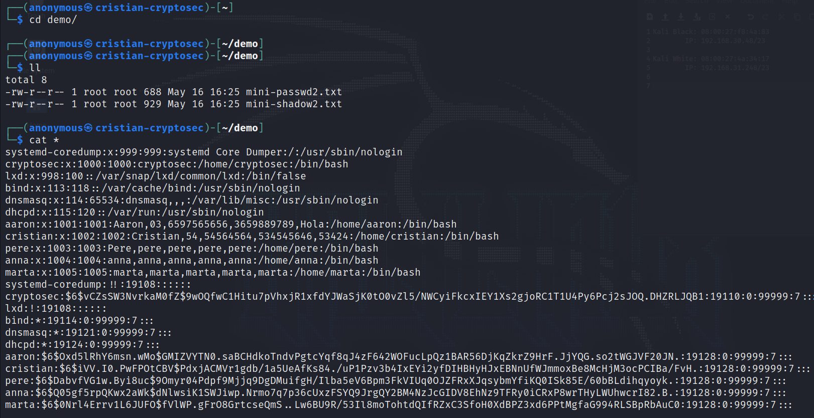
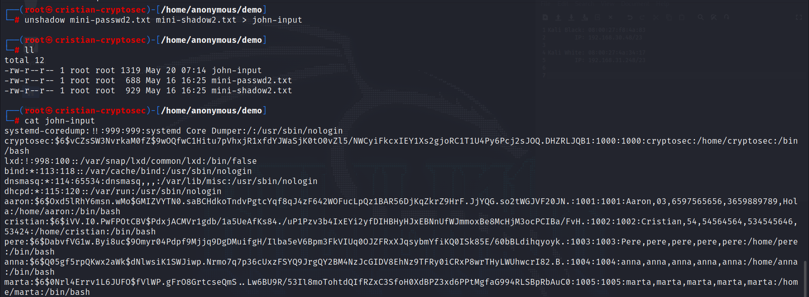
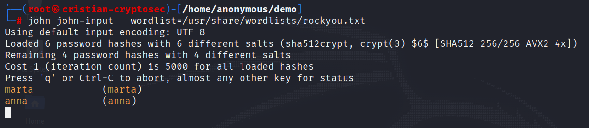
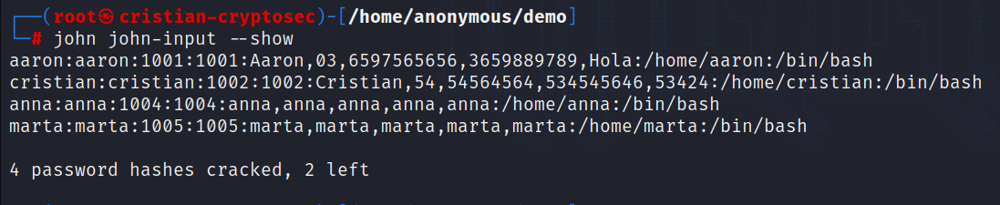
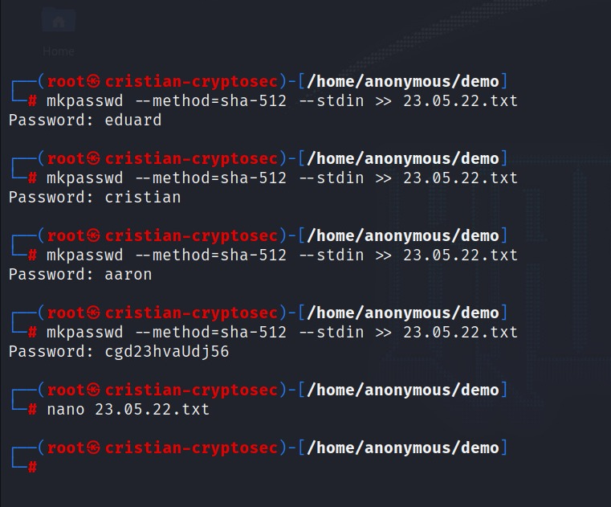

# __Projecte ASIX 2k22__
## __Escola Del Treball__
### __2HISX 2021-2022__
### __Aaron Andal & Cristian Condolo__


<br>
<br>
<br>
<br>

# __CryptoSEC__: "_Careful where you step in_"


<br>
<br>
<br>


# __Index__

+ Brute Force:[--> readME <--](#brute-force)

+ Practica:[--> readME <--](#practica)

    + Prova improvisada:[--> readME <--](#prova-improvisada)

+ Bibliografia:[--> readME <--](#bibliografia)

## __Brute Force__

Que no engagi el nom de __Força Bruta__, es un __atac criptografic__ que __prova totes les solucions possibles__ o molts d'elles. Tambe coneguda per la seva __recerca exhautiba y es molt utilitzada pels hackers__ per dexifrar passwords, i d'aquesta forma, __obtenir acces a dades externes__. Per això s'utilitza __un programari amb un algorisme__ simple que realitza la successió de diverses combinacions de caràcters compostos per dígits, espais i lletres fins a una longitud màxima definida.

No podem prendre'ns a la lleugera, ja que per un hacker es __facil trobar el fitxer necessaris per trobar el password__. Tot i que els __passwords__ no estan __en format text__, doncs han sigut __codificats__ previament __utilitzan algoritme criptografic__, el hacker pot __accedir als fitxers__ si aquest __no estan protejits__ contra accesos no autoritzats. Aquest pot __crear una copia del fitxers__ i executar en ells diferents atacs de Brute Force sense mantenir la connexio amb el sistema. Actualment, nomes existeixen __tres variables__ que faciliten al hacker cumpleix el seu cometit:
+ La __duració__ de cada pas de la verificació
+ La __longitud__ del password
+ La __complexitat__ del password


**Com prevenir-ho?**

Quan mes curta siguin els passwords, mes rapids seran descoberts per el metode de Brute Force. Es per aixo que se recomana utlitizar passwords mes complexo i llargs, que incluin diferents caracters i per aixo la majoria de sistemes de xifrat de contrasenyes utilitzen claus molt llargues. 


## __Practica__

> **Nota**: totes les ordres ha de ser executades per ```root```. En cas de no estar com a ```root```, posar sempres al principi ``sudo``.

1. Un cop a dins del Kali entrem dins del dir ``demo``, on es troben dos fitxer. Son dos copies dels files passwd i shadow d'algun client.



2. Como aquest es una atac offline, necesitem a juntar els dos fitxer (passwd + shadow), per tenir el ``username`` y ``password`` junts. 

``unshadow mini-password.txt mini-shadow.txt > john-input``
```cat john-input``



3. Ara passem a desencriptar el passwords, amb l'eina John. . Mitjançant un diccionario, on va provan moltes combinacion fins trobar un coincidenci.

> **Nota**: John The Ripper es un eina de recuperacio de passwords, es molt utilitzada pels hackers, que admet centenars de tipus __hash__ i de __xifratge__ per __passwords de Unix__, en el nostre cas esta desencriptan amb __hash__ *SHA215Unix*. 

``john john-input --wordlist=/usr/share/wordlists/rockyou.txt``



4. Durant el proces, es pot veure com va troban la ``password`` de cada ``username``.

5. Lo que faltaria seria espera fins que acabi, i quan acabi podem veure de nou el fitxer ``john-input``.



6. Una manera de comprovar si els ``passwords`` son certes seria entrar per ssh a la maquina.

``ssh marta@192.168.3.102``

### __Prova improvisada__

1. Com el cas anterior estaba preparat, llavors demostrarem com seria una prova en viu amb noves ``passwords`` encriptades, ho rediriguem a un fitxer i dins d'aquest l'hi fiquem el ``username``.

``mkpasswd --method=sha-512 --stdin >> passwds.txt``



2. I tornem a desencriptar-lo ambl'eina ``john``.

``john passwds.txt --wordlist=/usr/share/wordlists/rockyou.txt``

3. Durant el proces de desencriptacio, presionem ``Enter`` per poder veure com intenta amb cada combinació.

4. Tornem a esperar i veure com ha resultat.

## __Bibliografia__

+ https://www.ionos.es/digitalguide/servidores/seguridad/brute-force-definicion-y-medidas-de-proteccion/

+ https://www.zonasystem.com/2020/06/password-cracking-en-linux-john-the-ripper-hashcat.html

+ https://www.openwall.com/john/

+ https://www.youtube.com/watch?v=z4_oqTZJqCo&t=509s
