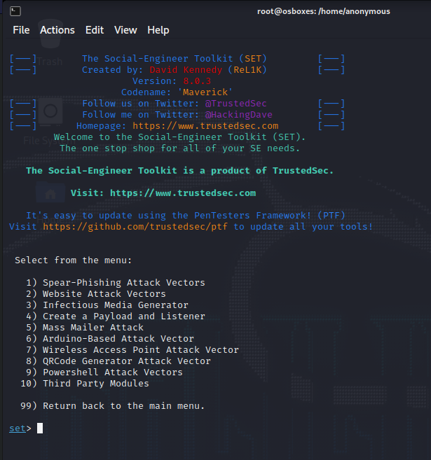
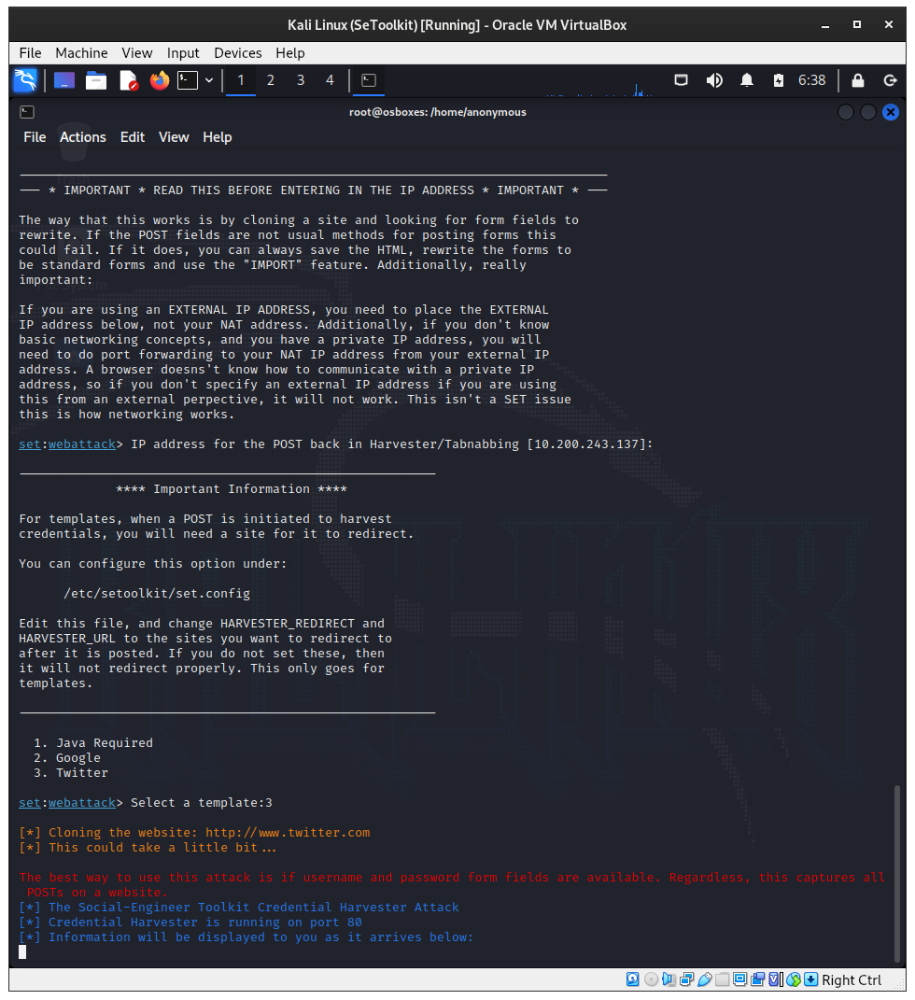
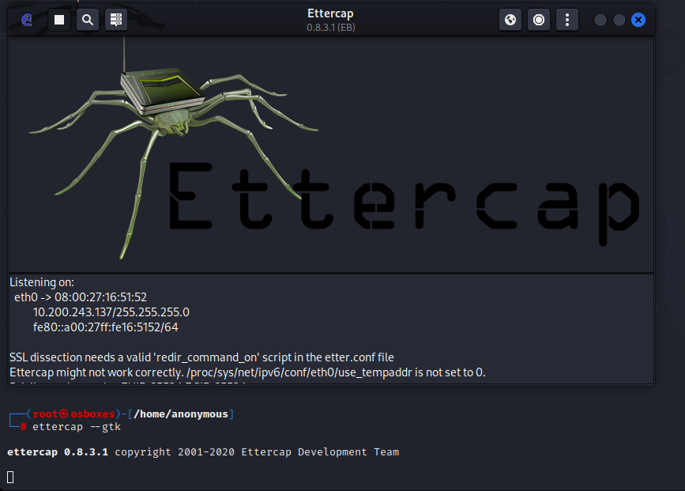
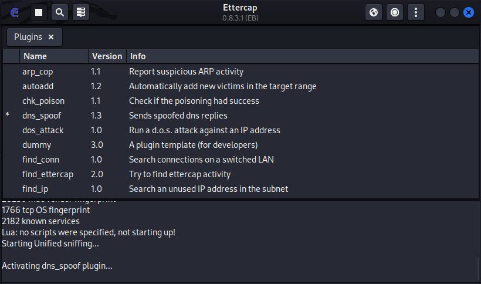

# __Projecte ASIX 2k22__
## __Escola Del Treball__
### __2HISX 2021-2022__
### __Aaron Andal & Cristian Condolo__

<br>

# __Ciberseguretat__: "_Careful where you step_" 🕵️ 🔎

<div style="align: center; width: 100%">
    
</div>

# Index

* **Lorem Ipsum**: [Plantilla](https://github.com/KeshiKiD03/asixproject2k22/)


* **Lorem Ipsum**: [Plantilla](https://github.com/KeshiKiD03/asixproject2k22/)


* **Lorem Ipsum**: [Plantilla](https://github.com/KeshiKiD03/asixproject2k22/)

# DNS Cache Poisoning / DNS Spoofing

Abans d'entrar en escena hi posem un exemple:

_Imagineu-vos que, un grup d'estudiants d'últim any d'EDT 2HISX, fan una broma als estudiants de batxillerat._ 

_Aquest grup d'estudiants "canvien" tots els números de les habitacions del campus de l'institut EDT, de manera que quan els nous estudiants de batxillerat (que encara no conèixen les instal·lacions del campus), l'endemà es apareguin en aules equivocades._

_Els números d'habitació que no coincideixen, s'enregistren en un directori del campus i els estudiants nous de batxillerat segueixen anant a les aules equivocades fins que algú finalment se'n adona i corregeix l'error._

L'exemple anterior és el __DNS Cache Poisoning__ o __DNS Spoofing__.

_DNS Cache Poisoning_ (enverinament de la memòria cau DNS), també es conegut com _DNS Spoofing_ (suplantació de DNS), és un atac del tipus _spoofing_ (suplantació) que consisteix en _alterar_ els registres DNS amb la finalitat de _redirigir_ el _fluxe de paquets_ entre un host (víctima) i un servidor a la seva _màquina atacant_.

> _"DNS Spoofing és l'acció d'introduïr informació falsa a una memòria cau DNS, modifica la taula ARP, fent creure que el client està parlant amb el servidor, però en realitat parla amb la màquina de l'atacant, lo mateix amb el servidor"_

Amb altres paraules, utilitza registres DNS alterats per redirigir el trànsit de paquets en una connexió, retornen una resposta incorrecta i les víctimes es dirigeixen als llocs _web fraudulents_ on a posteriori son infectats per _l'atacant_.

> _"Amb DNS Spoofing redirigim els paquets ipv4 entre el host i el servidor al host de l'atacant"_

Les _webs fraudulents_ son _"quasi"_ copies originals de pàgines web conegudes allotjades a la màquina de _l'atacant_.

> _"L'atacant implanta una pàgina web maliciosa i infecta la víctima"_

<div style="align: center; width: 100%">
    
</div>

Un cop allà, se'ls demana als usuaris que iniciïn sessió al seu compte (el que creuen que és), donant a l'autor l'oportunitat de robar les seves credencials d'accés i altres tipus d'informació sensible. A més, el lloc web maliciós s'utilitza sovint per instal·lar cucs o virus a l'ordinador d'un usuari, donant-li a l'autor accés a llarg termini i a les dades que emmagatzema.

Quan un servidor DNS ha rebut dades no autèntiques i les emmagatzema en memòria cau per augmentar el rendiment en el futur, es considera _enverinament_, proporcionant les dades no autèntiques als clients del servidor.

Les adreçes IP son com "números d'habitació" d'Internet, la qual cosa permet que el trànsit web arribi a llocs adequats.

La memòria CAU de les resolucions DNS són el _"directori del campus"_, quan emmagatzemen informació _defectuosa_, el trànsit va als llocs equivocats fins que es corregeix la informació.

Com que normalment els solucionadors de DNS no tenen cap manera de verificar les dades de la memòria cau, la informació de DNS incorrecta romandrà a la memòria cau fins que caduca el temps de vida (TTL) o fins que s'elimina manualment

Una sèrie de vulnerabilitats fan possible l'enverinament del DNS, però el principal problema és que el DNS es va crear per a una Internet molt més petita i es va basar en un principi de confiança (com ara BGP ). 
 
Un protocol DNS més segur anomenat _DNSSEC_ pretén resoldre alguns d'aquests problemes, però encara no s'ha adoptat àmpliament.


# Què fan els solucionadors de DNS?

Els solucionadors de DNS proporcionen als clients l'adreça IP associada a un nom de domini. 

En altres paraules, prenen adreces de llocs web llegibles per humans com "cloudflare.com" i les tradueixen a adreces IP llegibles per màquina. 

Quan un usuari intenta navegar a un lloc web, el seu sistema operatiu envia una sol·licitud a un solucionador de DNS. 

El solucionador de DNS respon amb l'adreça IP i el navegador web agafa aquesta adreça i inicia la càrrega del lloc web. 

# Com funciona la memòria cau DNS?

Un solucionador de DNS desarà les respostes a les consultes d'adreces IP durant un període de temps determinat. 

D'aquesta manera, el resolutor pot respondre a futures consultes molt més ràpidament, sense necessitat de comunicar-se amb els molts servidors implicats en el procés típic de resolució de DNS. 

Els solucionadors de DNS guarden les respostes a la memòria cau mentre els permeti el temps de vida designat (TTL) associat a aquesta adreça IP. 

Resposta DNS sense memòria cau: 

<div style="align: center; width: 100%">
    
</div>

Resposta DNS a la memòria cau: 

<div style="align: center; width: 100%">
    
</div>

# __Com enverinen els atacants la memòria cau DNS?__

Els atacants poden enverinar la memòria cau DNS suplantant la identitat dels noms DNS , fent una sol·licitud a un resolutor de DNS i, a continuació, forjant la resposta quan el resolutor de DNS consulta un servidor de noms. 

Això és possible perquè els servidors DNS utilitzen UDP en comptes de TCP i perquè actualment no hi ha cap verificació per a la informació DNS.

Procés d'enverinament de la memòria cau DNS: 

<div style="align: center; width: 100%">
    
</div>

Memòria cau DNS enverinada: 

<div style="align: center; width: 100%">
    
</div>

En lloc d'utilitzar TCP, en la que ambdues connexions fan un "handshake" per iniciar la comunicació i verificar la identitat dels dispositius.

Les solicituds i respostes DNS utilitzen UDP (User Datagram Protocol) (Port 53). No hi ha cap garantia que hi hagi una connexió oberta, que el destinatari estigui perparat per rebre o que l'emissor siguie qui diuen ser.

L'UDP és vulnerable a la falsificació per aquest motiu: Un atacant pot enviar un missatge mitjançant UDP i fingir que és una resposta d'un servidor autoritari i legítim, falsificant les dades de la _capçalera del paquet_.

Si un _solucionador de DNS_ rep una resposta falsificada, aquesta l'accepta i emmagatzema les dades de manera acrítica perquè no hi ha manera de verificar si la informació és precisa i prové d'una font legítima.

DNS es va crear als primers temps d'Internet, quan les úniques parts connectades amb ella eren les universitats i els centres de recerca. No hi havia cap raó per esperar que algú intentés difondre informació DNS falsa. 

Malgrat aquests principals punts de vulnerabilitat en el procés de memòria cau DNS, els atacs d'enverinament de DNS no són fàcils. 

Com que la resolució de DNS en realitat consulta el servidor de noms autoritzat, els atacants només tenen uns quants mil·lisegons per enviar la resposta falsa abans que arribi la resposta real del servidor de noms autoritzat. 

Els atacants també han de conèixen o endevinar una sèrie de factors per dur a terme atacs de suplantació de DNS:

1. Quines consultes DNS no s'emmagatzemen a la memòria cau pel _DNS Resolver_ de destinació, de manera que el resolutor consultarà el servidor de noms autoritzat.

2. Quin port fa servir el _DNS Resolver_, normalment s'utilitza el port 53 per a cada consulta DNS, pero ara, amb una bona construcció de DNS Segur pot ser que utilitzin un port aleatori cada vegada.

3. El número d'identificació de la solicitud

4. A quin servidor de noms autoritzat anirà la consulta.

Els atacants també podrien accedir a la resolució de DNS d'alguna altra manera. Si una part malintencionada opera, pirateja o obté accés físic a una solució de DNS, poden alterar més fàcilment les dades de la memòria cau. 

*En xarxes, un port és un punt virtual de recepció de comunicació. Els ordinadors tenen diversos ports, cadascun amb el seu propi número, i perquè els ordinadors es parlin entre ells, s'han de designar determinats ports per a determinats tipus de comunicació. Per exemple, HTTP sempre van al port 80 i HTTPS sempre utilitza el port 443. 

<br>
<br>
<br>

# __Métodes d'execució per a realitzar DNS Spoofing:__

* __Man in the middle (MITM):__ la intercepció de les comunicacions entre usuaris i un servidor DNS per tal d'encaminar els usuaris a una adreça IP diferent/maliciosa.

* __Compromís del servidor DNS:__ el segrest directe d'un servidor _DNS Resolver_, que està configurat per retornar una adreça IP maliciosa.

<div style="align: center; width: 100%">
    
</div>

### Exemple i explicació pràctic DNS Cache Poisoning

L'exemple anterior il·lustra un atac d'enverinament de memòria cau DNS, en què un __atacant__ (__IP 192.168.3.300__) intercepta un canal de comunicació entre un _client_ (__IP 192.168.1.100__) i un ordinador _servidor_ pertanyent al lloc web _www.estores.com_ (__IP 192.168.168. 2.200__).

En aquest escenari, s'utilitza una eina (per exemple, __arpspoof__) per enganyar el _client_ perquè pensi que la IP del servidor és __192.168.3.300__. 

Al mateix temps, es fa pensar al servidor que la IP del client també és __192.168.3.300__.

Un escenari així procediria de la següent manera:

1. __L'atacant__ utilitza _arpspoof_ per emetre l'ordre: ``arpspoof 192.168.1.100 192.168.2.200``. Això modifica les _adreces MAC_ a la taula _ARP del servidor_, fent-lo pensar que l'ordinador de __l'atacant__ pertany al __client__.

2. __L'atacant__ torna a utilitzar arpspoof per emetre l'ordre: ``arpspoof 192.168.2.200 192.168.1.100``, que indica al client que l'ordinador de l'autor és el servidor.

3. L'atacant emet l'ordre Linux: ``echo 1> /proc/sys/net/ipv4/ip_forward``. Com a resultat, els paquets IP enviats entre el _client_ i el _servidor_ es reenvien a l'ordinador de __l'autor atacant__.

4. El fitxer amfitrió, __192.168.3.300__ _estores.com_ es crea a l'ordinador local de __l'atacant__, que associa el lloc web _www.estores.com_ a la seva __IP local__.

5. __L'autor atacant__ configura un _servidor web_ a la IP de _l'ordinador local_ i crea un _lloc web fals_ fet per semblar a _www.estores.com_.

6. Finalment, s'utilitza una eina (per exemple, _dnsspoof_) per dirigir totes les _sol·licituds_ de DNS al fitxer __amfitrió__ local de __l'autor__. Com a resultat, el lloc __web fals__ es mostra als usuaris i, només en interactuar amb el lloc, s'instal·la programari maliciós als seus ordinadors.

<div style="align: center; width: 100%">
    
</div>


# Com prevenir DNS Spoofing?

Si bé hi ha diverses eines disponibles per trobar i fer front als DNS Spoofing.

## Implantació de DNSSEC

DNS és un __protocol sense xifrar__, que facilita la interceptació del trànsit amb falsificació. A més, els servidors DNS no validen les adreces IP a les quals estan redirigint el trànsit.

DNSSEC és l'abreviatura de Domain Name System Security Extensions i és un mitjà per verificar la integritat i l'origen de les dades DNS. El DNS es va dissenyar originalment sense aquesta verificació, per això és possible l'enverinament del DNS. 

Igual que TLS/SSL , DNSSEC utilitza la criptografia de clau pública (una manera de signar digitalment la informació) per verificar i autenticar les dades. Les extensions DNSSEC es van publicar l'any 2005, però DNSSEC encara no s'ha generalitzat, el que deixa el DNS encara vulnerable als atacs. 

__DNSSEC__ és un protocol dissenyat per protegir el vostre DNS afegint mètodes addicionals de verificació. El protocol crea una signatura criptogràfica única emmagatzemada al costat dels altres registres DNS, per exemple, un registre i CNAME. Aquesta signatura l'utilitza el vostre solucionador de DNS per autenticar una resposta de DNS, assegurant-vos que el registre no s'hagi manipulat.

Tot i que DNSSEC pot ajudar a protegir contra la falsificació de DNS, té una sèrie de possibles desavantatges, com ara:

Manca de confidencialitat de les dades: DNSSEC s'autentica, però no codifica les respostes DNS. Com a resultat, els autors encara poden escoltar el trànsit i utilitzar les dades per a atacs més sofisticats.
Desplegament complex: DNSSEC sovint es configura malament, cosa que pot fer que els servidors perdin els avantatges de seguretat o fins i tot denegar l'accés a un lloc web.
Enumeració de zones: DNSSEC utilitza registres de recursos addicionals per habilitar la validació de la signatura. Un d'aquests registres, NSEC, és capaç de verificar la inexistència d'una zona DNS. També es pot utilitzar per caminar per una zona DNS per reunir tots els registres DNS existents, una vulnerabilitat anomenada enumeració de zones. Les versions més noves de NSEC, anomenades NSEC3 i NSEC5, publiquen registres hash dels noms d'amfitrió, xifrant-los i evitant l'enumeració de zones.

# Exemple DNS Spoofing

## Exemple 1 ARP Spoof i DNS Spoof

En la xarxa de CryptoSEC, s'implementa un DNS (Bind9) a Ubuntu Server 20.04 que hi donarà peticions de resolució de noms a Debian Minimal.

La estructura de la xarxa serà la següent:

+ Ubuntu Server 20.04: 

    + enp0s3 (Bridge): DHCP o STATIC amb conexió a Internet.

    + enp0s8 (CryptoSEC): Xarxa interna de CryptoSEC amb la resolució de noms __cryptosec.net__.

    + Iptables: NAT a l'exterior.

+ Kali Linux (Atacant) (DNS Spoofing atacker): També pertany a la Xarxa de CryptoSEC (L'atacant és un dels treballadors, té la connexió encryptada i ningú sap de la seva existència). Farà el poisoning del DNS i farà creure que tant el servidor com el client Debian Minimal, fan la connexió entre ells 2 (Però la veritat es que ho fà al Kali Linux tota l'estona).

+ Debian Minimal: Pertany a la Xarxa de CryptoSEC. Rebrà la petició de DNS i conexió a Internet surtint per la Gateway del Servidor.

### 1. Configuració de XARXA:

1. Obrim les 3 màquines virtuals Ubuntu Server, Debian i Kali Linux.

2. Al servidor, li obrim dos ports un de Bridge i l'altre de Xarxa Interna.

```
# Servidor Ubuntu 20.04

ip a

ip a show enp0s8

ip address add 192.168.3.1/24 dev enp0s8

ip r

# Debian Minimal

ip a show enp0s3

ip address add 192.168.3.2/24 dev enp0s3

ip r


# Kali Linux

ip a show enp0s3

ip address add 192.168.3.3/24 dev enp0s3

ip r

# Test de conectivitat

ping x.x.3.1

ping x.x.3.2

ping x.x.3.3

```

3. Tant Kali Linux com Debian Minimal pertanyen a la Xarxa de CryptoSEC. Se li posen les IP manualment (De moment, més endavant DHCP).

4. El servidor inicia el servei de noms de DNS. El client Debian fa peticions de resolució normal.

```bash
# DNS "cryptosec.net"

## named.conf.default-zones

zone "cryptosec.net" {
        type master;
        file "/etc/bind/db.cryptosec.net";
};

## db.cryptosec.net

$TTL    604800
@       IN      SOA     cryptosec.net. mail.cryptosec.net. (
                              2         ; Serial
                         604800         ; Refresh
                          86400         ; Retry
                        2419200         ; Expire
                         604800 )       ; Negative Cache TTL

@       IN      NS      cryptosec.net.
@       IN      A       192.168.3.1
www     IN      CNAME   cryptosec.net.

```

```bash
# Reiniciem el servidor BIND9

sudo systemctl restart bind9

# Si tinguéssim un error:

sudo journalctl -u named.service -f & # Per fer una auditoria del servei i veure on hem fallat.

sudo named-checkzone cryptosec.net db.cryptosec.net # Per veure la zona "cryptosec.net"

sudo named-checconf db.cryptosec.net # Per veure la configuració de l'arxiu "cryptosec.net"
```

* Verififiquem en el client Debian Minimal
```
host cryptosec.net

cryptosec.net has address 192.168.3.1

```

```
# Opcional FER NAT a l'EXTERIOR 
  
#! /bin/bash
# @edt ASIX M11-SAD Curs 2018-2019
# iptables

echo 1 > /proc/sys/net/ipv4/ip_forward

# Regles flush
iptables -F
iptables -X
iptables -Z
iptables -t nat -F

# Polítiques per defecte:
iptables -P INPUT ACCEPT
iptables -P OUTPUT ACCEPT
iptables -P FORWARD ACCEPT
iptables -t nat -P PREROUTING ACCEPT
iptables -t nat -P POSTROUTING ACCEPT

# obrir el localhost
iptables -A INPUT  -i lo -j ACCEPT
iptables -A OUTPUT -o lo -j ACCEPT

# obrir la nostra ip
iptables -A INPUT -s 192.168.33.44 -j ACCEPT
iptables -A OUTPUT -d 192.168.33.44 -j ACCEPT

# Fer NAT per les xarxes internes:
# - 192.168.3.0/24

iptables -t nat -A POSTROUTING -s 192.168.3.0/24 -o enp0s3 -j MASQUERADE
```


5. Kali Linux, intercepta la conexió (MITMA), suplanta el reenviament de paquets entre el "servidor Ubuntu" i el client "Debian Minimal".

```bash
# Host Kali

sysctl -w net.ipv4.ip_forward=1 # Activar ip forward

# arpspoof -i [Network Interface Name] -t [Victim IP] [Router IP]

arpspoof -i eth0 -t 192.168.3.2 192.168.3.1


```

6. Canvia la taula ARP del servidor i del client.

7. Un cop té accés al DNS, pot implantar una pàgina nova falsa.

8. El client cau en la pàgina falsa i es infectat. (AMB __DNSSPOOF__).

9. Podem fer el monitoreig amb WIRESHARK o ETTERCAP.


## Exemple 2: Utilitzant __setoolkit__ a Kali Linux

Demostració ràpida de com DNS pot ser suplantat utilitzant Kali Linux, i com el tràfic pot ser redirigit a una pàgina fraudulenta.

Hem decidit fer phishing la pàgina de Twitter utilitzant una eina anomenada "setoolkit" i fer un clonatge de la pàgina de Twitter.

Posteriorment suplantar el registre DNS en la que apuntava a twitter.com a la nostra màquina, on hi tenim un allotjat una pàgina fraudulenta utilitzant l'eina.

_Website Attack Vectors -> Creditials Harvestor -> Clone website / Use Web Template_

https://www.amirootyet.com/post/how-to-spoof-dns-in-kali-linux/ 

Utilitzarem un "toolkit" anomenat "setooklit" que es permetrà fer phishing a una pàgina i fer un clonatge perfecte.


<div style="align: center; width: 100%">
    
</div>

Podem fer un clonatge d'una pàgina web o també té "templates" pre definides. En aquest exemple utilitzarem el template de https://www.twitter.com

Tarda una estona.

<div style="align: center; width: 100%">
    
</div>

<div style="align: center; width: 100%">
    
</div>

Com podem observar la pàgina de Twitter està a la nostra IP 10.200.243.137 al port 80.

Ara necessitem que tot el tràfic per a twitter.com sigui redirigit a la meva IP. Utilitzarem DNS Spoof que està disponible a ETTERCAP.

S'ha de canviar el contigut del fitxer etter.dns per a que twitter.com apunto a la nostra IP.

`apt-get install mlocate`

`updatedb`

`locate etter.dns`

┌──(root㉿osboxes)-[/home/anonymous]
└─# locate etter.dns
/etc/ettercap/etter.dns
/usr/share/ettercap/etter.dns.examples

`cp /etc/ettercap/etter.dns /etc/ettercap/etter.dns.original`

`vi /etc/ettercap/etter.dns`

```
*.twitter.com   A       10.200.243.137
www.twitter.com PTR     10.200.243.137

www.alor.org    A       127.0.0.1
www.naga.org    A       127.0.0.1
```

Obrim Ettercap


<div style="align: center; width: 100%">
    
</div>


`ettercap --gtk` --> Fem el loadup.


Ens anem a `Plugins` --> `Manage the Plugins` --> `DNS Spoof plugin` --> L'activem.

<div style="align: center; width: 100%">
    
</div>

A continuació, ARP enverinará tots els amfitrions de la xarxa, de manera que tot el trànsit passa per la nostra màquina (atacant) --> començarem a "esnifar".

Quan algú intenti accedir a twitter.com, la finestra d'ettercap dirà "bla_bla.twitter.com" falsificat a la ip de l'atacant `<la_nostra_ip>`.

Al mateix temps, a la finestra SET, veuràs "tenim un èxit!!" juntament amb alguna altra informació. Si la víctima és prou crédula per introduir les seves credencials a la vostra pàgina de pesca, veureu aquests detalls a la finestra SET.

Però heu de jugar al joc d'espera i esperar fins que algú intenti accedir al lloc web de pesca. 

```
# Kali Linux

arp -a

arpspoof -i eth0 -t 10.200.243.211 10.200.243.1 # Suplantació redirecció de paquets al CLient

arpspoof -i eth0 -t 10.200.243.1 10.200.243.211 # Suplantació redirecció de paquets al Servidor

```

```
# Host local

Connectar-se a Twitter - Farà la redirecció a 10.200.243.137


```

<div style="align: center; width: 100%">
    
</div>

# Ettercap per CLI

- https://esgeeks.com/tutorial-ettercap-ejemplos/

Utiliza el siguiente comando para lanzar una suplantación de DNS:

sudo ettercap -T -q -P dns_spoof -i wlan0 -M arp /// ///
#Otro comando, para toda la red
sudo  ettercap -T -q -M arp -i wlan0 -P dns_spoof -p //192.168.1.1/
#Para un rango de red
sudo ettercap -T -q -M arp -i wlan0 -P dns_spoof //192.168.1.1/ 192.168.1.51/

# Explicació resumida:

ARP Spoof - DNS Cache Poisoning

IP Atacant. 10.200.243.137 
MAC Atacant: 08:00:27:16:51:52

IP Victima: 10.200.243.212
MAC Victima: 18:c0:4d:a0:8f:c8

IP Router Gateway: 10.200.243.1
MAC Router Gateway: 00:22:57:be:53:01

Pàgina clonada: http://www.twitter.com


SPOOF del tràfic entre la VÍCTIMA I EL ROUTER --> ES CANVIA LA MAC DEL CLIENT VICTIMA PER LA MEVA: 18:c0:4d:a0:8f:c8 PER LA MEVA (ATACANT): 08:00:27:16:51:52.

EN REALITAT QUI CONECTA AMB EL SERVIDOR, SOC JO NO LA VÍCTIMA. FEM LA TORNADA.
 
└─# arpspoof -i eth0 -t 10.200.243.212 10.200.243.1
8:0:27:16:51:52 18:c0:4d:a0:8f:c8 0806 42: arp reply 10.200.243.1 is-at 8:0:27:16:51:52

"Tot el fluxe que va del servidor a la víctima, redirigeix-los a la meva màquina"

TORNADA

SPOOF del tràfic entre la EL ROUTER I LA VICTIMA --> ES CANVIA LA MAC DEL DEL ROUTER PER LA MEVA: 0:22:57:be:53:1 PER LA MEVA (ATACANT): 08:00:27:16:51:52.

EN REALITAT QUI CONECTA AMB EL SERVIDOR, SOC JO NO LA VÍCTIMA. FEM LA TORNADA.

┌──(root㉿osboxes)-[/home/anonymous]
└─# arpspoof -i eth0 -t 10.200.243.1 10.200.243.212
8:0:27:16:51:52 0:22:57:be:53:1 0806 42: arp reply 10.200.243.212 is-at 8:0:27:16:51:52
8:0:27:16:51:52 0:22:57:be:53:1 0806 42: arp reply 10.200.243.212 is-at 8:0:27:16:51:52

"Tot el fluxe que va de la víctima al servidor, redirigeix-los a la meva màquina"


RESUM: TOT EL TRÀFIC DE PAQUETS QUE SURT DE LA VÍCTIMA AL SERVIDOR, SERÀN "FORWARD" AL MEU CLIENT ATACANT. JA QUE EL LA VÍCTIMA CREU QUE QUI CONTACTA ES AL ROUTER, PERO NO. SUPLANTO LA MAC DESTÍ DEL ROUTER PER LA MEVA.


# Solució:
https://www.keyfactor.com/blog/what-is-dns-poisoning-and-dns-spoofing/ 


# Bibliografia
- https://www.imperva.com/learn/application-security/dns-spoofing/
- https://programmerclick.com/article/2815493326/
- https://www.amirootyet.com/post/how-to-spoof-dns-in-kali-linux/
- https://es.acervolima.com/ataque-mitm-man-in-the-middle-usando-arp-poisoning/
- https://www.cloudflare.com/learning/dns/dns-cache-poisoning/
- https://www.okta.com/identity-101/dns-poisoning/
- https://www.boomernix.com/2018/03/realizando-un-dns-spoofing.html
- https://www.keyfactor.com/blog/what-is-dns-poisoning-and-dns-spoofing/
- https://ciberseguridad.blog/25-tipos-de-ataques-informaticos-y-como-prevenirlos/
- https://esgeeks.com/tutorial-ettercap-ejemplos/