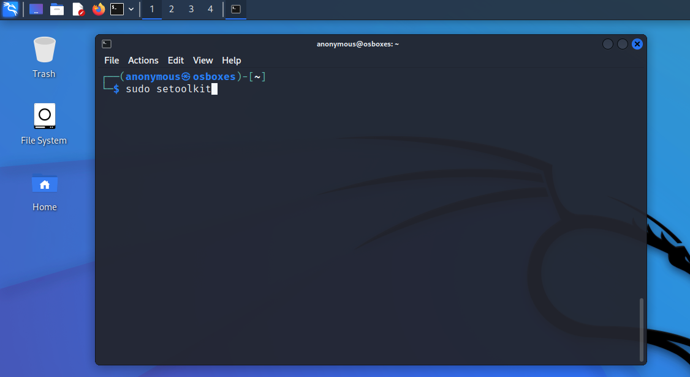
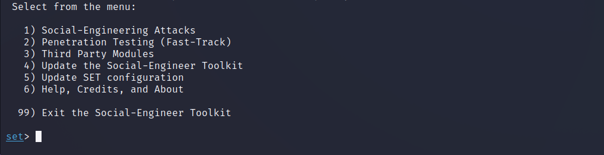
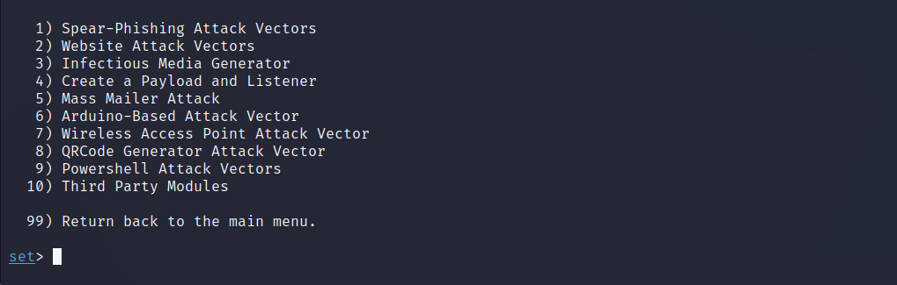
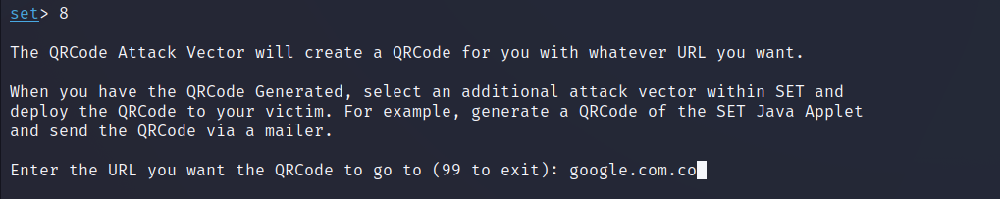
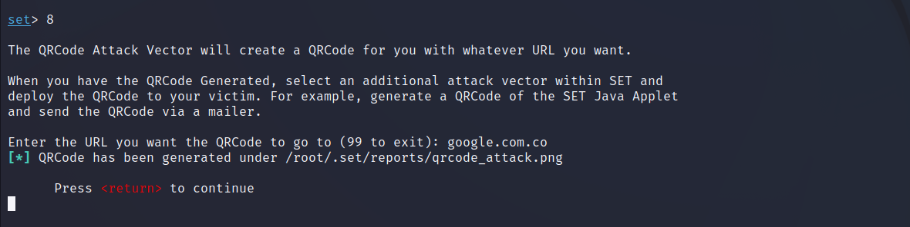
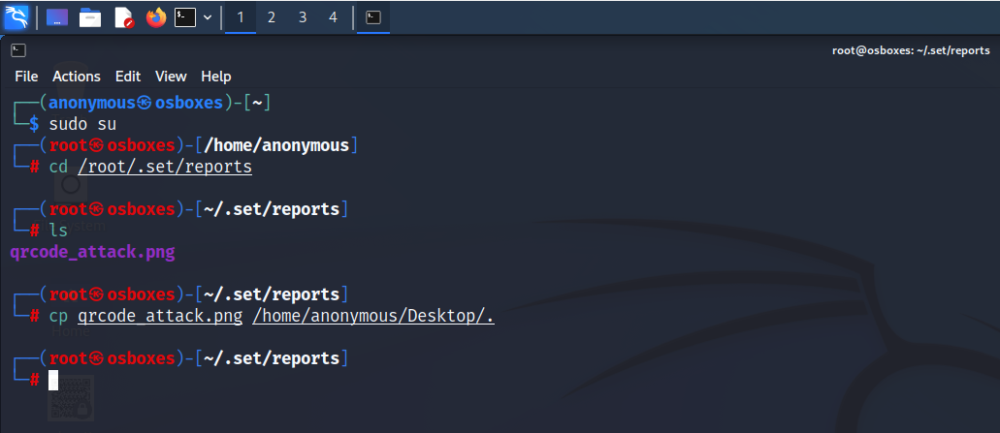
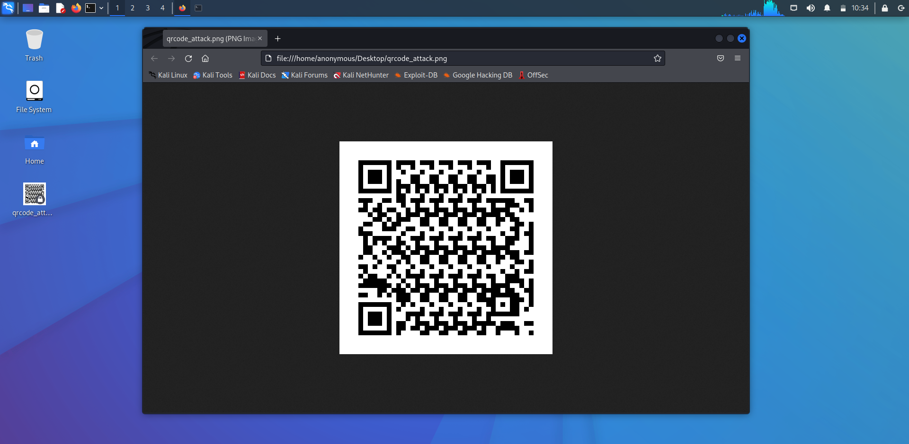

# __Projecte ASIX 2k22__
## __Escola Del Treball__
### __2HISX 2021-2022__
### __Aaron Andal & Cristian Condolo__

<br>

# __Ciberseguretat__: "_Careful where you step_" 🕵️ 🔎

<div style="align: center; width: 100%">
    
</div>

# Index

* **Atac d'Enginyeria Social**: [Plantilla](https://github.com/KeshiKiD03/asixproject2k22/)


* **Com prevenir atacs d'Enginyeria Social?**: [Plantilla](https://github.com/KeshiKiD03/asixproject2k22/)


* **Certificats d'autenticació / OpenSSL**: [Plantilla](https://github.com/KeshiKiD03/asixproject2k22/)


* **Certificats d'autenticació / OpenSSL**: [Plantilla](https://github.com/KeshiKiD03/asixproject2k22/)

# Atac d'Enginyeria Social

L'enginyeria social és l'art de __manipular__ les persones perquè renunciïn a la __informació confidencial__. 

Els tipus d'informació que busquen aquests delinqüents poden variar, però quan els individus són blancs, els delinqüents generalment intenten enganyar-lo perquè li doni la contrasenya o informació bancària, o accedeixi al seu pc per instal·lar en secret el programari maliciós, que li donarà accés contrasenyes i informació bancària, així com per donar-los control sobre aquest.

Els delinqüents usen tàctiques d'enginyeria social perquè generalment és més fàcil explotar la inclinació natural a confiar que descobrir maneres de piratejar el teu programari. Per exemple, és molt més fàcil enganyar algú perquè li doni la contrasenya que intentar piratejar la contrasenya (llevat que la contrasenya sigui realment feble).

La seguretat es tracta de saber en qui i què confiar. Saber quan i quan no fer-ho per prendre la paraula d'una persona; quan confiar que la persona amb qui ens estem comunicant és de fet la persona amb qui penses que t'estàs comunicant; quan confiar que un lloc web és o no és legítim; quan confiar que la persona que està parlant per telèfon és o no és legítima; quan proporcionar la nostra informació és o no és una bona idea.

Pregunti-li a qualsevol professional de la seguretat i et diran que la baula més feble a la cadena de seguretat és l'ésser humà que accepta una persona o un escenari al peu de la lletra. No importa quants panys i forrellats hi ha a les nostres portes i finestres, o si tenim gossos guardians, sistemes d'alarma, reflectors, tanques amb filferro de pues i personal de seguretat armat; si confiem en la persona de la porta que diu que ell és el repartidor de pizzes i ho deixem entrar sense verificar primer si és legítim, estem completament exposat a qualsevol risc que representi deixar-lo entrar.

[](https://www.youtube.com/watch?v=xDdVnRHO3CE)


# Com prevenir atacs d'Enginyeria Social?

+ __Ves més a poc a poc__. Els spammers volen que actuïs primer i pensis més tard. Si el missatge transmet una sensació durgència o usa tàctiques de venda dalta pressió, hem de ser escèptics. Mai no hem de deixar que la urgència influeixi en la nostra revisió acurada.

+ __Investigueu els fets__. Sospita de qualsevol missatge no sol·licitat. Si el correu electrònic sembla una empresa que nosaltres utilitzem, hem de fer la nostra pròpia recerca. Utilitza un motor de cerca per anar al lloc de la companyia real, o una guia telefònica per trobar el número de telèfon.

+ __Eliminar qualsevol sol·licitud dinformació financera o contrasenyes__. Si ens demanen que responguem a un missatge amb informació personal, és una estafa.

+ __Rebutgeu les sol·licituds d'ajuda o les ofertes d'ajuda__. Les empreses i organitzacions legítimes no es posen en contacte amb per brindar-nos ajuda. Si no heu sol·licitat específicament l'ajuda del remitent, considereu qualsevol oferta per 'ajudar', una estafa. De la mateixa manera, si rebem una sol·licitud dajuda duna organització benèfica o organització amb la qual no tenim una relació, elimina-la. Per donar, busqueu organitzacions caritatives de bona reputació pel seu compte per evitar caure en una estafa.

+ __No permeteu que un enllaç controli on acaba__. Mantingues el control buscant el lloc web tu mateix usant un motor de cerca per assegurar-nos que acabem on planegem acabar. En passar el ratolí sobre els enllaços al correu electrònic, es mostrarà la URL real a la part inferior, però una bona còpia falsa, pot guiar-nos incorrectament.

<div style="align: center; width: 100%">
    
</div>


La curiositat condueix a clics descuidats, si no sabem de què es tracta el correu electrònic, fer clic a enllaços és una opció inadequada. De la mateixa manera, mai no hem d'usar números de telèfon per al correu electrònic.

+ __El segrest de correu electrònic és desenfrenat__. Els pirates informàtics, els generadors de correu no desitjat i els generadors de xarxes socials que prenen el control dels comptes de correu electrònic de les persones (i altres comptes de comunicació) han crescut descontroladament. Quan controlen el compte de correu electrònic d'algú, s'aprofiten de la confiança de tots els contactes de la persona. Fins i tot quan el remitent sembla ser algú que vostè coneix, si no espera un correu electrònic amb un enllaç o fitxer adjunt, verifica amb el teu amic abans d'obrir enllaços o descarregar.

+ __Compte amb qualsevol descàrrega__. Si no coneixem el remitent personalment però esperem un fitxer, descarregar qualsevol cosa, pot ser un error.

+ __Les ofertes estrangeres són falses__. Si rebem correus electrònics de loteries o sorteigs estrangers, diners d'un parent desconegut o sol·licituds per transferir fons des d'un país estranger per part dels diners, és una estafa.

+ __Establir els filtres de correu brossa a nivells alts__. Cada programa de correu electrònic té filtres de correu brossa. Per trobar el vostre, cerqueu a les opcions de configuració i establiu aquests valors alts, només recordeu revisar la seva carpeta d'spam periòdicament per veure si el correu electrònic legítim ha arribat accidentalment allà. També podem buscar una guia pas a pas per configurar els filtres dspam buscant en el nom del seu proveïdor de correu electrònic.

+ __Assegurar els dispositius informàtics__. Instal·lar programari antivirus, tallafocs, filtres de correu electrònic i mantenir-los actualitzats. Configurar els sistemes operatius perquè s'actualitzin automàticament. Utilitzar una eina anti-phishing oferta al navegador web, normalment en mode de plugin, és també una gran idea.

## 2. Certificats d'autenticació / OpenSSL

Els pirates informàtics mai no desapareixeran, però una cosa que podem fer és que sigui pràcticament impossible penetrar en els sistemes (per exemple, xarxes Wi-Fi, sistemes de correu electrònic, xarxes internes) mitjançant la implementació __d'autenticació basada__ en __certificats__ per a totes les màquines i dispositius dels empleats. 

Això vol dir que només els punts finals amb certificats configurats correctament poden accedir als seus sistemes i xarxes. 

Els certificats són fàcils d'usar (no cal maquinari addicional per administrar o es necessita molta capacitació de l'usuari) i les implementacions es poden automatitzar per simplificar les coses i fer que els hackers tinguin més difícil un atac.

## Practica de Atac d'Enginyeria Social

Dins d'una maquina Kali Linux on esta hi un munt d'eines per en aquest cas utilitzarem nomes una eina anomenada Social-Engineer Toolkit.

Aquesta eina ja bé instal·lat al Kali aixi que nomes tenim que executar-la.
Per utilitzar aquest eina, hem d'obrir una terminal i executar-la com administrador:
````
sudo setoolkit
````
<center></center><br>

Ens surt una presentació molt xula (com a la majoria d'eines dins de Kali)
Un cop estem dins, ens mostrar el menu d'opcions com per exemple:
<center></center><br>

Ara mateix nomes en interesa el ``Social-Engineering Attacks``.
Sel·leccionem l'opcio 1.
````
set> 1
````
Un cop dins ens trobem amb 10 diferents tipus d'atacs sobre enginyeria social:
<center></center><br>

Escollirem una sencella i ja mes endavant anirem provant les demes.
Per aquest exemple practica escollirem l'Atacs QR
Sel·leccionem l'opció 8.
````
set> 8
````
Omplim amb les dades següent:
- Escollim la adreça URL que volem que la QR redireccioni a la nostra victima.
<center></center><br>

Es genera l'imatge QR a dins d'aquest directori. I ja el tindriem.
<center></center><br>

En una altre terminal, entrem dins del directori on s'ha generat l'imatge QR i la copiem dins de l'Escriptori.
<center></center><br>

Comprovem que esta a l'Escriptori.
<center></center><br>

Nomes queda mostrar la QR a la nostra victima i caigui en la nostra trampa.