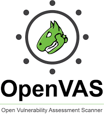

# __Projecte ASIX 2k22__
## __Escola Del Treball__
### __2HISX 2021-2022__
### __Aaron Andal & Cristian Condolo__

<br>

# __Ciberseguretat__: "_Careful where you step_" 🕵️ 🔎


# Index

* **OpenVAS**: [README](#descripcióbiografia)

* **Practica**: [README](#practica)

* **Bibliografia**: [README](#bibliografia)

> **NOTA: per desgràcia, no hem pogut implementar a dins. La nostra idea era que un dels Kalis pogués monitoritzar els Clients i les dues xarxes, per mostrar l'abans i després d'algun atacs.** 

## __OpenVAS__: Open Vulnerability Assessment System 

Es un escàner de vulnerabilitats amb totes les funcions. Les seves capacitats inclouen proves no autenticades i autenticades, diversos protocols industrials i d'Internet d'alt i baix nivell, ajust de rendiment per a exploracions a gran escala i un potent llenguatge de programació intern per implementar qualsevol tipus de prova de vulnerabilitat.
L'escàner obté les proves per detectar vulnerabilitats a partir d'un canal que té un llarg historial i actualitzacions diàries.

OpenVAS ha estat desenvolupat i impulsat per l'empresa Greenbone Networks des de l'any 2006. Com a part de la família de productes de gestió de vulnerabilitats comercials Greenbone Enterprise Appliance, l'escàner forma Greenbone Vulnerability Management juntament amb altres mòduls de codi obert.



Ens va permetre escanejar objectius tan dispositius mòbils, dispositius de xarxa, PC, etc. allò que sigui que estigui connectada a la nostra xarxa. Amb el fi d'aconseguir possibles vulnerabilitats que tinguin aquestes hosts i per poder fer dues coses:
- Per una banda, si som l'atacant o l'auditor, intentar explotar-les.
- I si estem a l'equip de defensa, intentar defensar-los i tancar-los correctament.


Dins del panl de monitoritzacio del OpenVAS podem veure les xarxes, hosts o un grup d'IPs per poder escanjer a dispositius de xarxa, a dispositius mobils, a servidors, a PC, a aplicacion, un munt de coses.


## __Practica__

1. Actulitzar el sistema (pot trigar una estona!).

``sudo apt update -y && sudo apt -disupgrade -y``

2. Aque ja si, instal·lar el paquet OpenVAS.

``sudo apt install openvas -y``

3. Ara passem a lo mes aburrit, esperar. Instal·lem l'aplicacio, per aixo necessitar descarregar totes les firmes per poder detectar vulnerabilitats que qualsevol sistema per exemple apache2, windows, ... En resum que trigarar un mun de hores. En el nostre cas va tarda 1 hora i mig . En un altre exemple va trigar 3 hores.

``sudo gmv setup``

4. Un cop acabat l'instal·lacio ens donara un nom d'usuari i un password per poder entrar al panel del OpenVAS. Es important guardar-ho en un lloc segur.

````
admin
aa6f95ca-9641-47f4-bd7d-7a5c5a56b934
````

5. Primer inicem el openvas. En cas de que surti ``Failed`` el podem resoldre amb un ``restart`` o en aquest cas es un ``stop`` i un ``star`` de nou.

``sudo gmv star``

6. Quant el servidor s'engega, ja ens obre un navegador. Nomes queda aceptar el certificats i iniciar sessio al OpenVAS. Ja podem observer i escanejar els dispositus/hosts/IPs de la nostra xarxa i d'altres xarxes.

## __Bibliografia__
- https://www.youtube.com/watch?v=Sf9LKyCpgPc