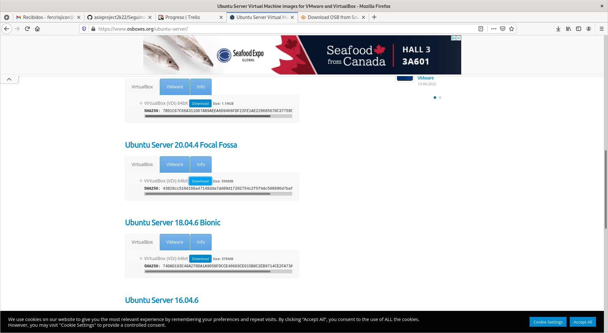
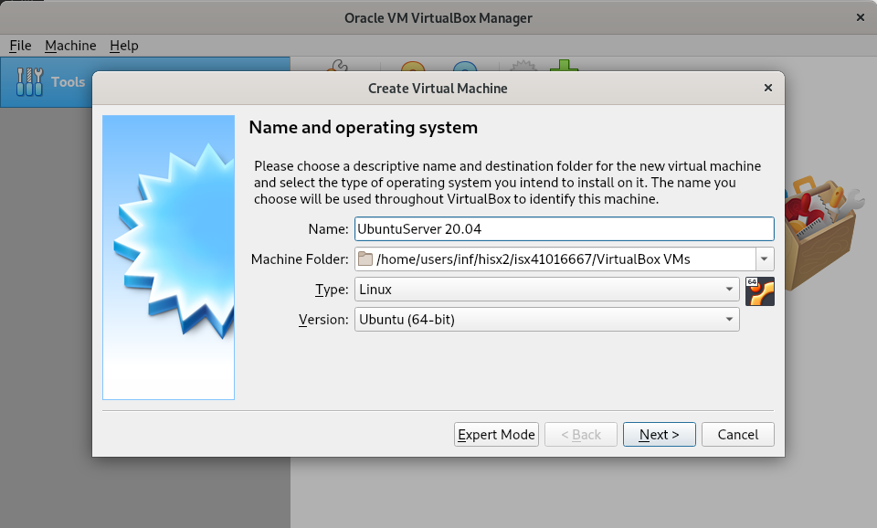
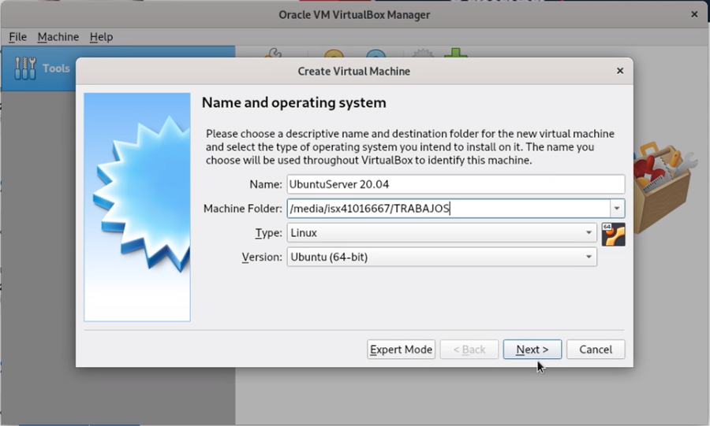
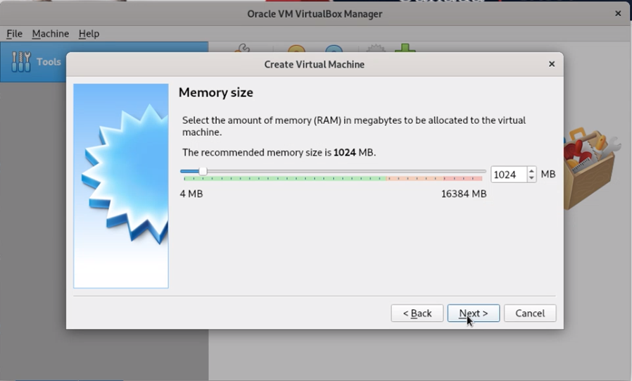
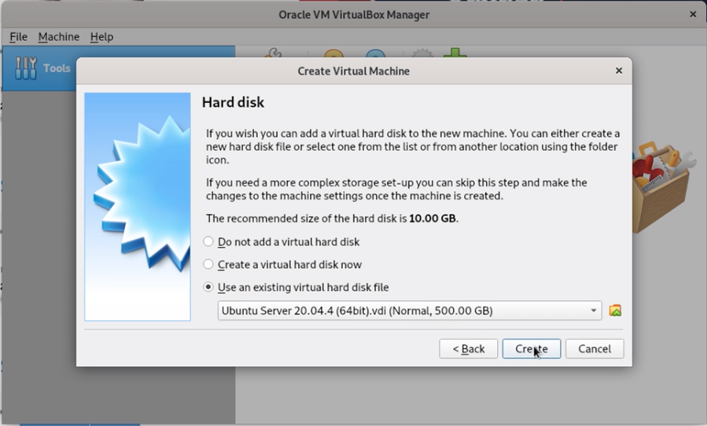
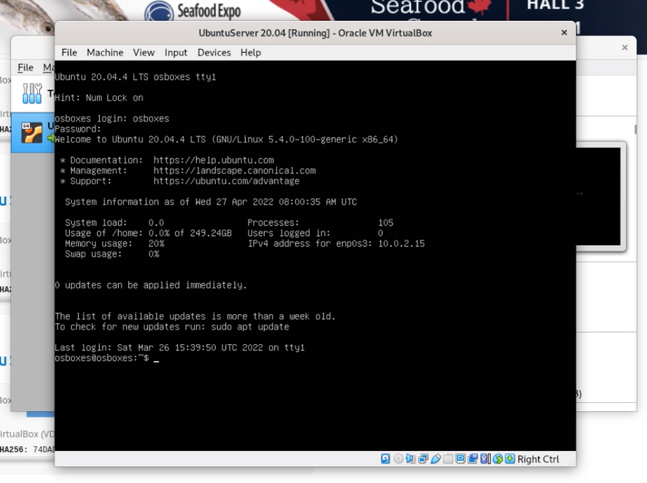

# Muntan Wazuh Server en VirtualBox (Ubuntu Server)
1. Descarrego un VDI (VistualDiskImage) de Ubuntu Server 20.04.4 Focal Fossa dins de: https://sourceforge.net/projects/osboxes/files/v/vb/59-U-u-svr/20.04/20.04.4/64bit.7z/download .
  

2. Despres de descomprimir la descarrega, obro el VirtualBox per crear una nova maquina virtual (UbuntuServer 20.04).
  

3. Omplu les mides necessaries per la maquina i fico el vdi que vaig descarregar anteriorment.

 

 

4. Engego la maquina i inicio sessió com osboxes (password: osboxes.org)
  

5. Instal·lo algun útils bàsics per poder treballar i Canvio la configuració del teclat a català