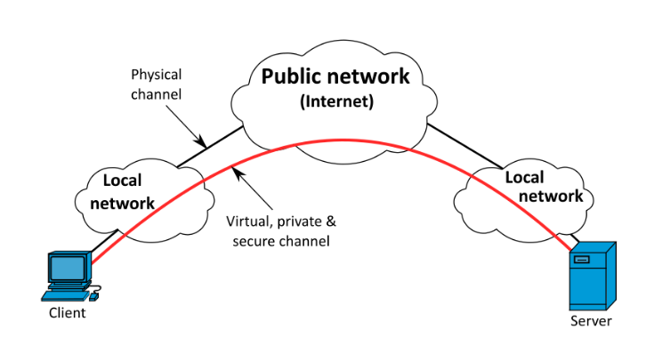

# Projecte ASIX 2k22
## Escola Del Treball
### 2HISX 2021-2022
### Aaron Andal & Cristian Condolo

 
 

# WireGuard VPN

# Index

**Wireguard (VPN)**: [Wireguard](https://github.com/KeshiKiD03/asixproject2k22/)

# Qué es una VPN?

El terme de VPN prové de "__Virtual Private Network__", és una tecnologia que permet a través d'una connexió a Internet, una connexió segura a una altra xarxa privada.

Permet, a més, enviar i rebre dades com si formi part de la mateixa xarxa local o privada. Obtenint així les funcionalitats que la mateixa xarxa ofereix.

També pot fer de referencia a una _xarxa virtual_ com a un túnel, pero lo que fa realment es _crear_ un _canal_ para el _tràfic_ entre el _client_ i el _servidor VPN_. En el seu contingut arrenca de manera independent i la resta, de maneda xifrada.

Recapitulant, bàsicament permet crear una __xarxa local__ sense necessitat de que els hosts que hi formen part, estiguin _físicament_ conectats entre _sí_.

Proporciona una _flexibilitat_ i _escalabilitat_ absoluta. Es poden crear clients VPNs desde qualsevol lloc del món i clients d'altra.

Ara que conèixem lo que significa una VPN i les avantatges que ens ofereix, és el moment de preguntar-nos.

Necesitem les VPN? 🤔

    

# Son necesaries les VPN?

* Lorem ipsum

* Lorem ipsum

    

## Bibliografia

