# __Projecte ASIX 2k22__
## __Escola Del Treball__
### __2HISX 2021-2022__
### __Aaron Andal & Cristian Condolo__

# Ubuntu Server

# Instal·lació Ubuntu Server 20.04

    

1. Descarregar-nos la ISO de Ubuntu Server 20.04 LTS: [downloadISO](https://releases.ubuntu.com/20.04/)

1. Obrir VirtualBOX --> New --> Name --> Memoria 1024M --> Create virtual Hard Disk Now --> VDI 70GB    --> Dynamic size.

    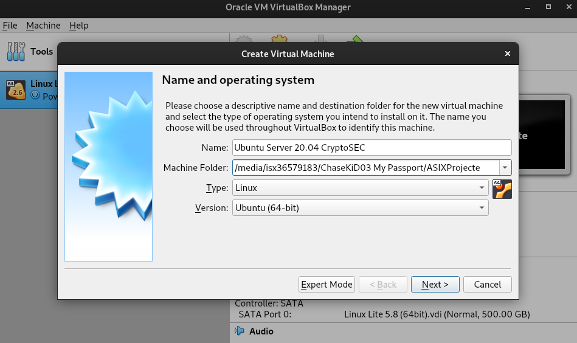

    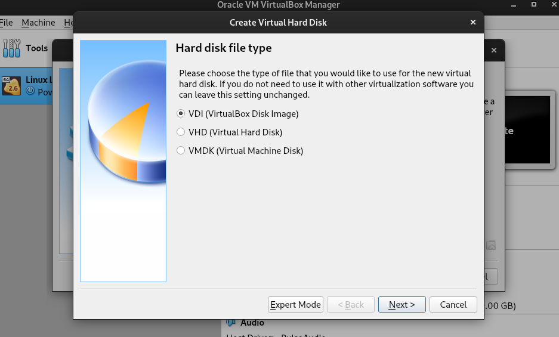

2. Afegim el disk ISO manualment.

    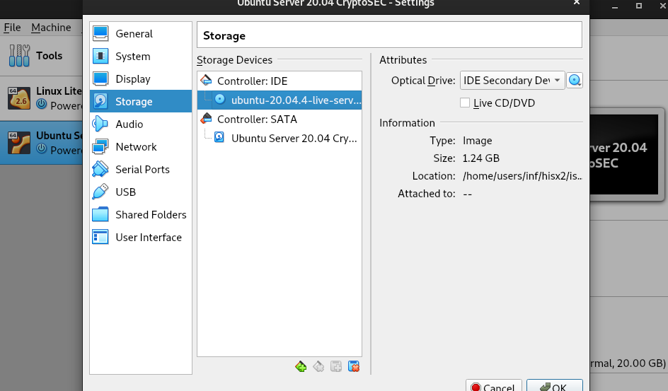

3. Canviar l'ordre d'arrencada.

    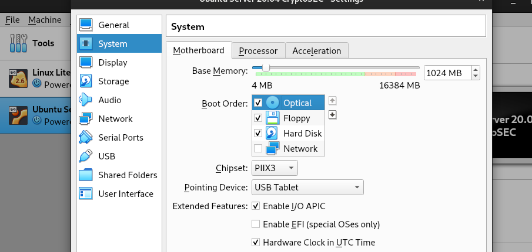

4. Seleccionem English com a idioma del sistema i teclat en Català.

    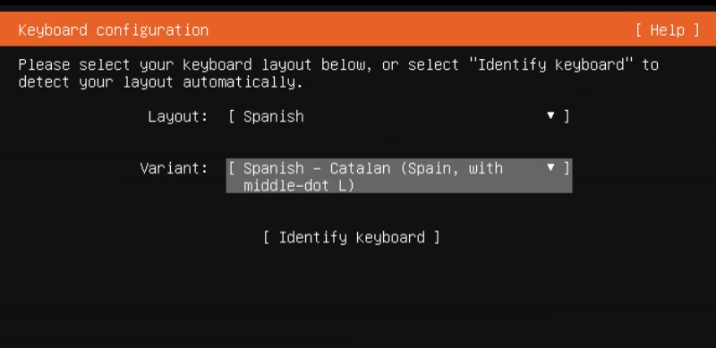

5. De moment la configuració de xarxa la deixem tal qual amb NAT, després la canviarem.

    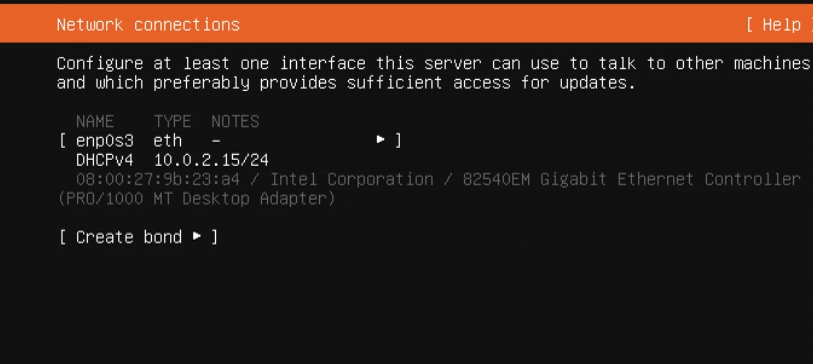

6. Ubuntu Server es farà l'automatització de les particions per a que sigui adequat per a UB Server. Utilitzarà LVM pel que veiem.

    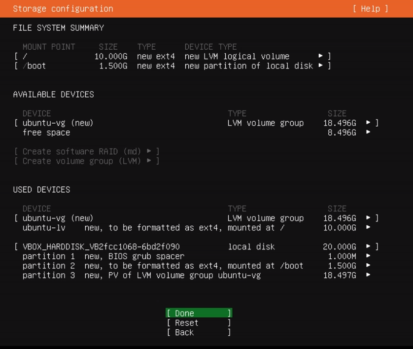

7. Posem les nostres dades de Servidor.

    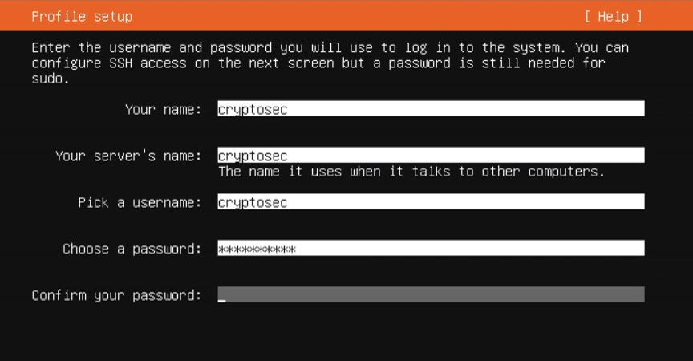

8. Seleccionem alguns repositoris que ens interessen com _docker_ o _aws-cli_.

    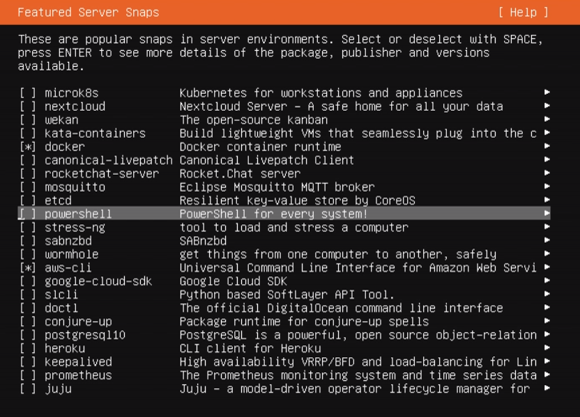

9. Esperem a que s'instal·li correctament.

    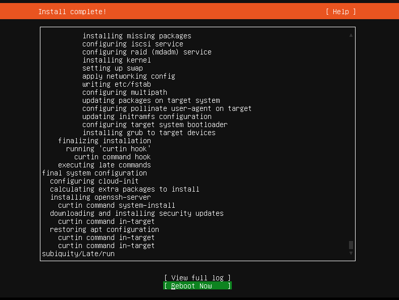

10. Rebotar i treure la disc ISO. Canviar l'arrencada.

    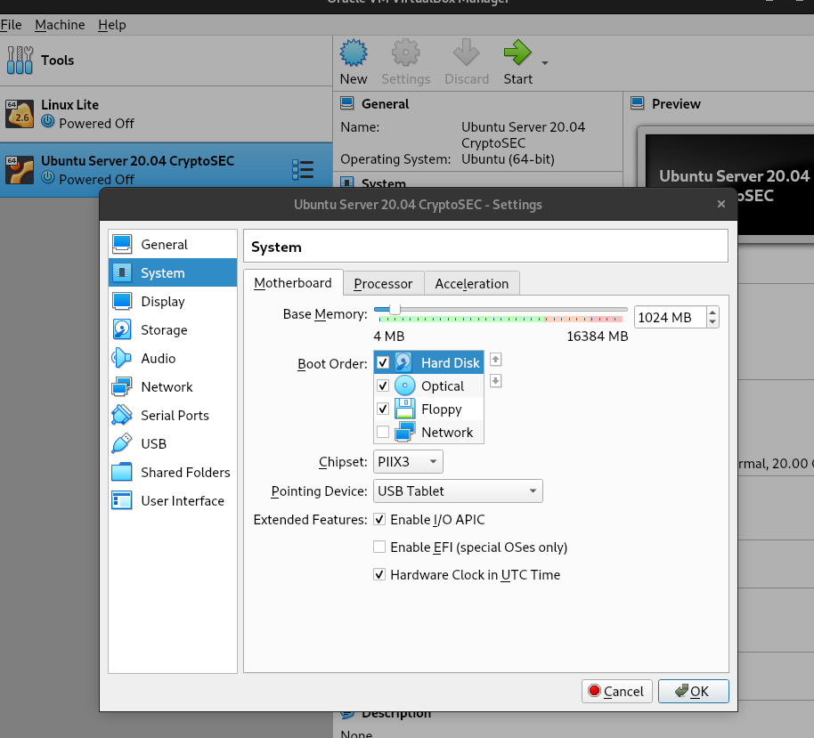

# Quick configuration

1. Update repository: `apt-get update`

2. Canviar el _keyboard-configuration_: 

* `apt install -y keyboard-configuration console-setup netcat`

3. Configurar el _keyboard-configuration_: `dpkg-reconfigure keyboard-configuration`

    + Teclat genèric.

    + Spanish --> Spanish - Catalan (Spain, with middle-dot L)

    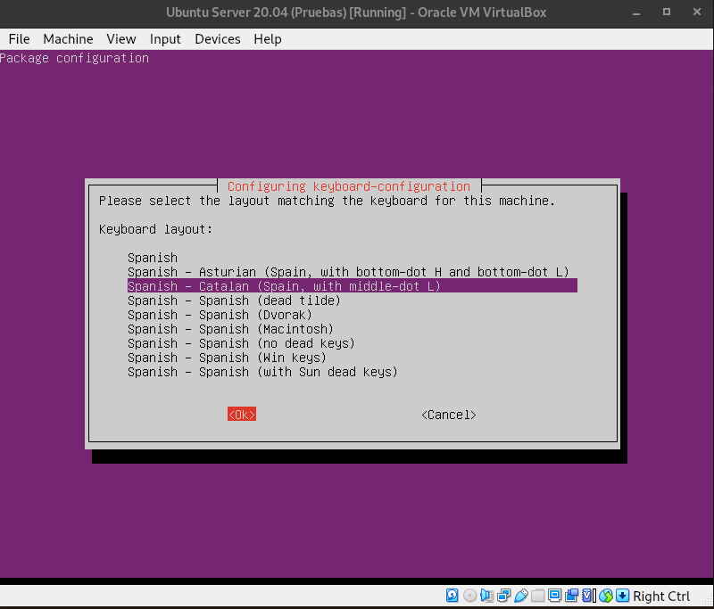

https://www.redeszone.net/noticias/seguridad/error-usar-mismo-nombre-credenciales/

4. Instal·lar __Guest Additions i SSH__: