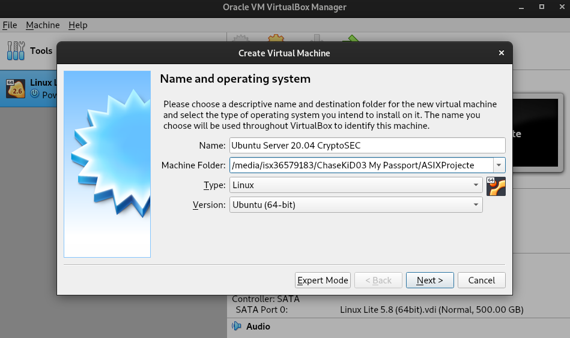
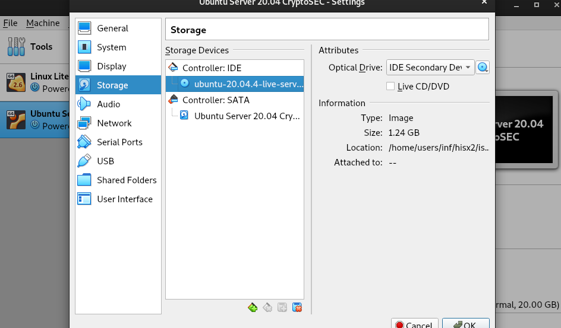
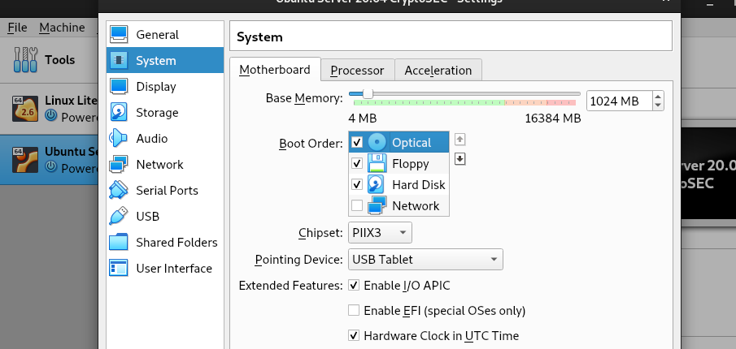
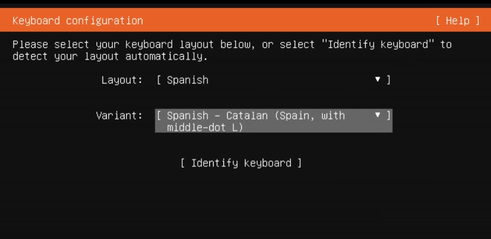
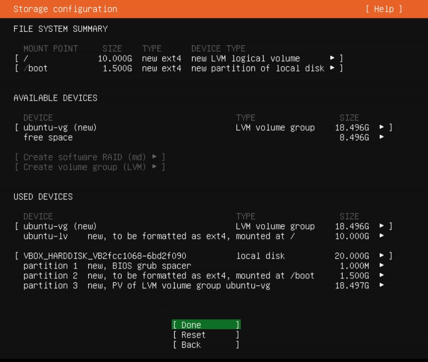
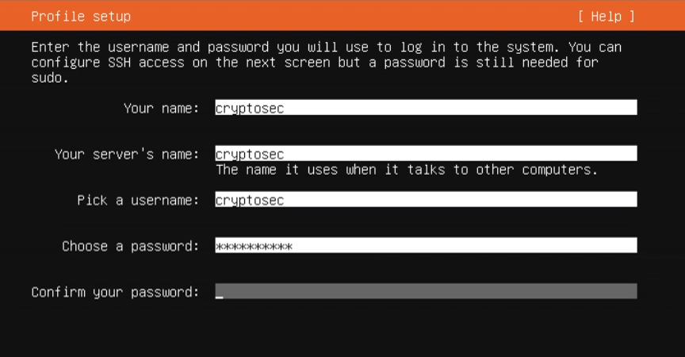
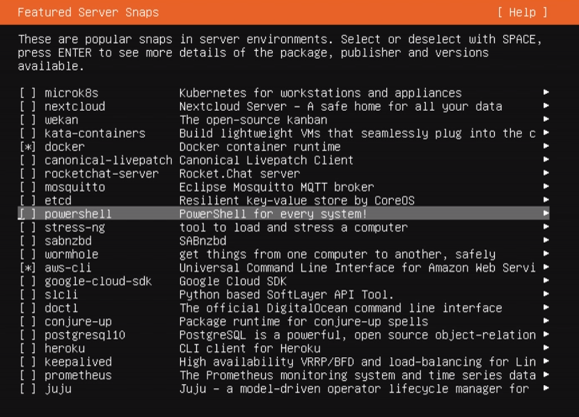
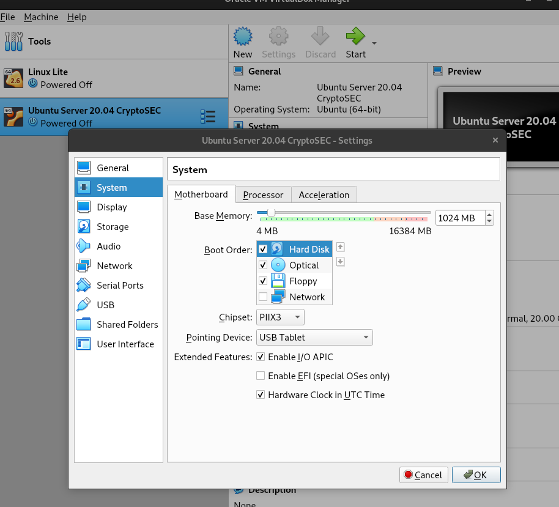
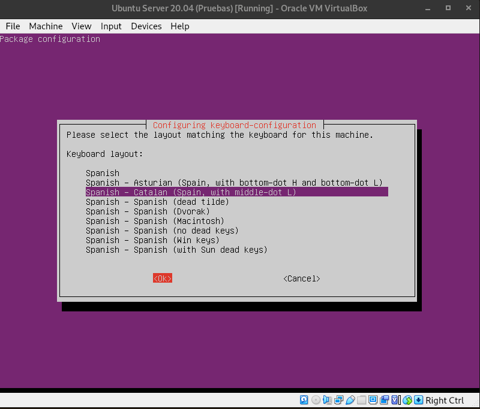

# __Projecte ASIX 2k22__
## __Escola Del Treball__
### __2HISX 2021-2022__
### __Aaron Andal & Cristian Condolo__

 
 
 
 

# __CryptoSEC__: "_Careful where you step in_"

 
 
 

# __Index__

+ **Instal·lació Ubuntu Server 20.04**: [--> readME <--](#installació-ubuntu-server-2004)

+ **Quick configuration**: [--> readME <--](#quick-configuration)

# __Instal·lació Ubuntu Server 20.04__

1. Descarregar-nos la ISO de Ubuntu Server 20.04 LTS: [downloadISO](https://releases.ubuntu.com/20.04/)

1. Obrir VirtualBOX --> New --> Name --> Memoria 1024M --> Create virtual Hard Disk Now --> VDI 70GB    --> Dynamic size.

2. Afegim el disk ISO manualment.

3. Canviar l'ordre d'arrencada.

4. Seleccionem English com a idioma del sistema i teclat en Català.

5. De moment la configuració de xarxa la deixem tal qual amb NAT, després la canviarem.

6. Ubuntu Server es farà l'automatització de les particions per a que sigui adequat per a UB Server. Utilitzarà LVM pel que veiem.

7. Posem les nostres dades de Servidor.

8. Seleccionem alguns repositoris que ens interessen com _docker_ o _aws-cli_.

9. Esperem a que s'instal·li correctament.

10. Rebotar i treure la disc ISO. Canviar l'arrencada.

# __Quick configuration__

1. Update repository: `apt-get update`

2. Canviar el _keyboard-configuration_: 

* `apt install -y keyboard-configuration console-setup netcat`

3. Configurar el _keyboard-configuration_: `dpkg-reconfigure keyboard-configuration`

    + Teclat genèric.

    + Spanish --> Spanish - Catalan (Spain, with middle-dot L)

4. Instal·lar __Guest Additions i SSH__

5. Instal·lar serveis necessaris:

* __bind9 (_Per forwarder i soa_)__

* __dhcp (_Per forwarder_)__

* __nmap__

* __net-tools__

* __procps__

* __iproute2__

* __bind-utils__

* __apache2 (_Per SOA_)__

* __wazuh (_Per forwarder_)__

... _entre altres_

# __Bibliografia__

- https://ubuntu.com/download/server
- https://ubuntu.com/tutorials/install-ubuntu-server#1-overview
- https://ubuntu.com/server
- https://www.redeszone.net/tutoriales/servidores/ubuntu-server-instalacion-configuracion/
- https://vivaubuntu.com/instalar-ubuntu-server-20-04-lts/